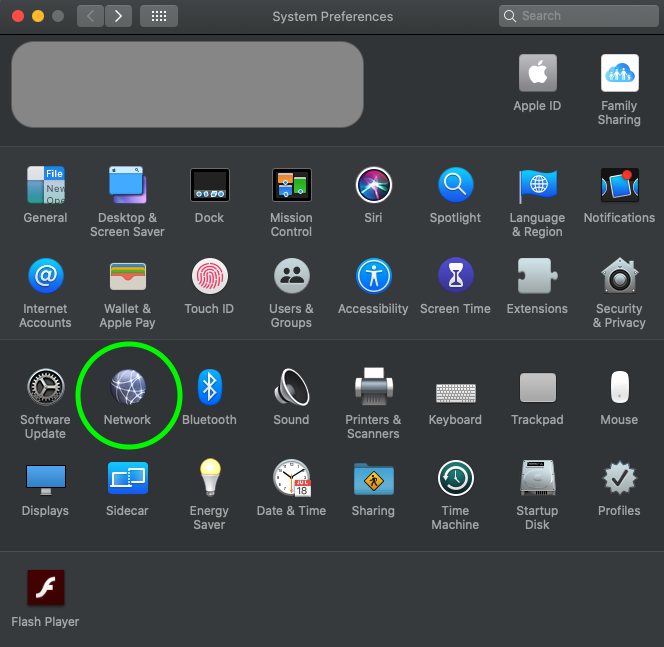
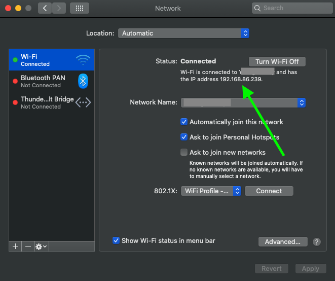

# Run Your React App On A Mobile Device

## Prerequisites

* Your Macbook and phone or tablet is on the same wifi network

Before we can view the React app on a phone or tablet we need to start and run the React app.

## Step 1: On your Macbook

1. In VS Code open your React app

2. Using Terminal type `npm start` to run your React app. This will open your browser and display the React app.
    * Take note of the port number in the URL address bar.

        `localhost: 3000` <--3000 is the port number
3. Open up your Terminal and type the command `ipconfig getifaddr en0` to print out your IP Address
    * The format will appear like `192.168.88.232`

4. With our IP Address and our port number we can create a new URL that can be access from a phone or tablet.

## Step 2: Now let's go to your phone or tablet

1. Go to your phone or tablet, open your browser and in the URL address type your IP Address and port number.
    * For example `192.168.88.232: 3000`

2. You should now see your React app!

## Troubleshooting

### I can't find my IP Address

#### Mac OS

If you're having trouble finding your IP Address with Terminal here is an alternative way:

1. Go to System Preferences > Network

    

2. View your IP Address in the Wi-Fi section of Network

    
