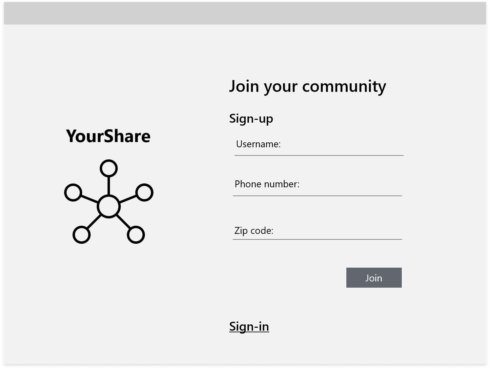
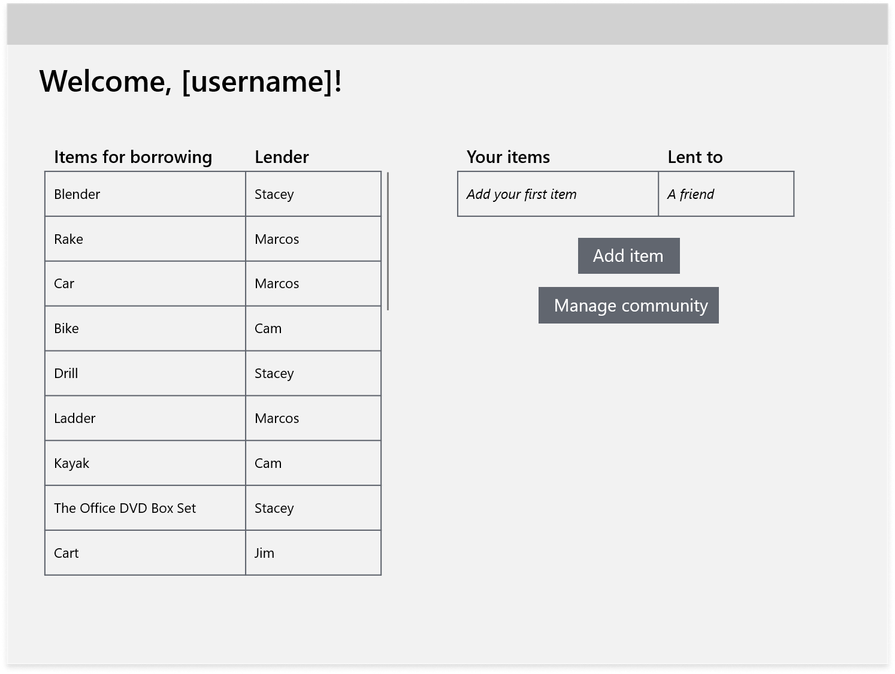
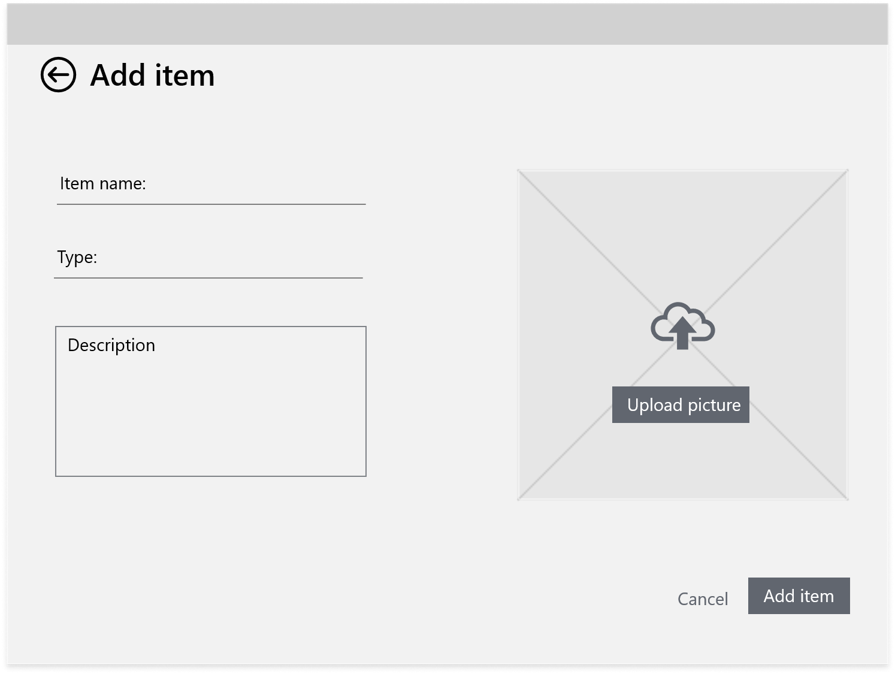
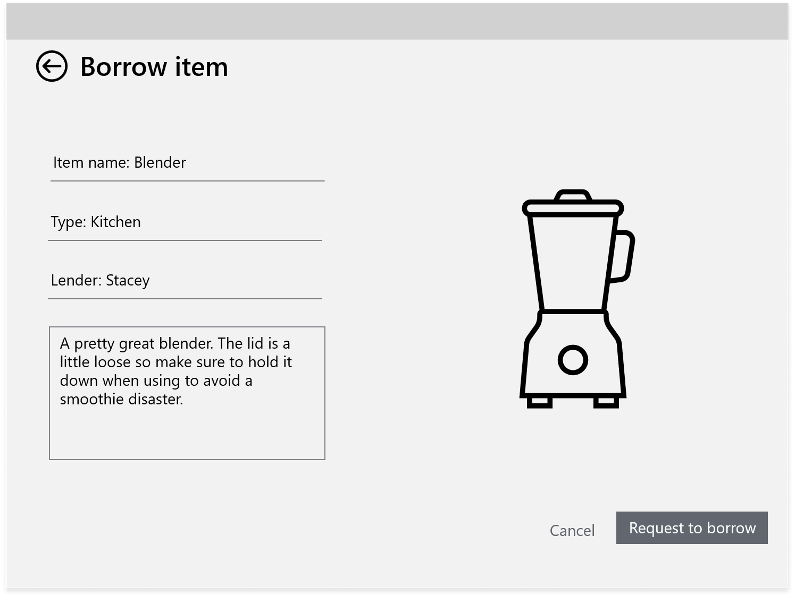
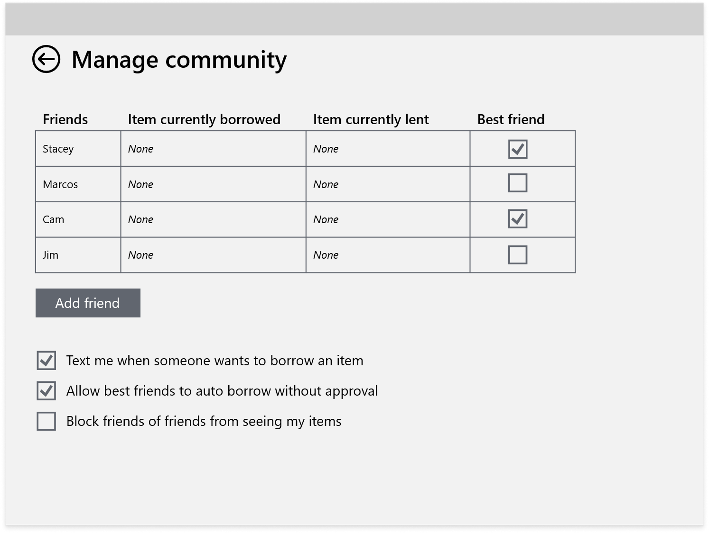
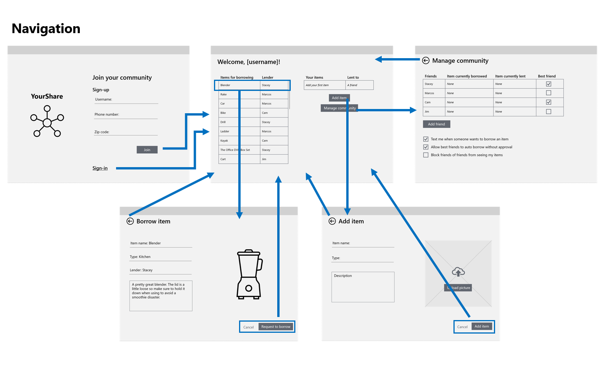

*This is a minimal viable sample spec*

# YourShare

## Problem statement

There's value in what communities collectively own today that's untapped. People are likely to buy something they use infrequently and there are barriers to sharing and discovering what's available in friend and community circles. How might we enable individuals to share what they own, reducing waste and creating stronger local communities.

## Summary

Today sharing economy is in the hands of large corporations who operate bike, car, and living sharing marketplaces. Free exchange of goods falls onto platforms based on ad revenue. How do we bring that back down to communities and enable neighbors and friends to get collective benefit of what they own today? YourShare enables individuals to open what they have to their circles. Lenders can post items for sharing and borrowers can find what they need to get a job done. Have a car that you don't drive daily? Have a blender you only use sometime? Post these items and let others share value in what you own. Need a weed wacker to cleanup the block? Check out YourShare to see if a neighbor can chip in. YourShare starts with individuals and grows into a community lending library.

## Customer profile

YourShare's initial target market is college students and the communities around college and university campuses.

* Who - college students and people who live and work in the surrounding communities.
* What - who don't always have what the need to get something done, nor have the space or money to own a lot.
* Where - locally, leave physically near one another.
* Why - in a survey conducted of college students 78% of students responded that they had items they were willing to loan, 82% said that they were interested in borrowing items, and 88% said they'd prefer to borrow and loan items from people they know. (100 students surveyed from colleges and universities across the country)
* When - as needed, with the flexibility have having access to the right item, tool, or transportation.
* How - reach out and share through an app.

Cam is a college junior. They just moved into their own apartment. Later in the fall Cam notices the leaves need cleaning up in their elderly neighbors yard. Cam looks to borrow a rake from someone nearby. They're glad they found another neighbor with two rakes and who offered to jump in to help out.

Stacey is a graduate student. She's accumulated some kitchen appliances as friends have moved away. She only uses them sometimes but isn't ready to give them away. Stacey is looking for any easy way to let friends, and friends of friends, know they can barrow her blender and popcorn air popper whenever they'd like. Stacey is happy that her appliances are getting more ues.

Marcos has a car on campus. He uses it occasionally to drive out to the grocery store. Marcos's friends borrow the car frequently. He wants an easy way to manage sharing his ride. Marcos is relieved that some of the stress is taken out of lending is car.

## Goals

* Reduce waste - many appliances are needed infrequently, once or twice a month. In an effort of conservation, borrowing something reduces energy and material used in manufacturing the product and reduces the waste at the end of the product life, preventing one more thing from ending up in the landfill.
  * Number and variety of items listed on YourShare
  * User service prompt to measure if it saved a purchase
* Create local sharing economies - large companies drive the sharing economy today. YourShare gives it back to communities.
  * Adoption of YourShare with a college or university community area, % of population
* Improve resiliency of communities - communities that share can depend on another in good times and in times of trial.
  * Average number of shares over time against economic and health highs and lows

## In scope

* P0: A user can sign-up for the app
* P0: A user can post new items
* P0: A user can browse items
* P0: A user can request to borrow items
* P0: A user can add friends and manage permissions
* P1: A user can manage the items they have posted
* P1: A user can sort items
* P2: A user can upload a photo of the item.
* P2: A user can search for items
* P2: A user can see items on a map

## Out of scope

* A user can schedule the availability of items
* A user can block a user from borrowing items
* A user can access default circles based on location
* A user can see where items are on a map
* A local community group can integrate their existing lending library
* A local community group can manage their library

## UX

*This spec just includes UX for the P0 items as part of the team practice project. Final specs should include UX for all listed user stories*

YourShare is first being built as a large screen application. The success of YourShare depends on community adding items. From user feedback we found this is best done from a larger screen device with a keyboard. There is also a high density of information that's best displayed on a larger screen.

The image assets are in the [YourShare-screens](YourShare-screens) folder - icon, upload, blender.

When a user navigates to your share, they land on the landing page to sign-up or sign-in. If the user is already signed in they will automatically land on the browse item page. The authentication is handled through the phone number and text confirmation.

This is the main screen of the app. It shows the items that can be borrowed. If is user is signed up through a friend invite, the screen displays items available within that circle of friends. From here, the user can access adding items, borrowing items, and managing friends and settings.

This is the add item screen. It has the basic fields for a user to submit a new item. Uploading an image is a stretch goal, it starts a just a placeholder.

This is the borrow item screen. Selecting an item from the available list lands here. Items are only shown if available. The user requests to borrow and the lender gets a text to approve or deny. Again the image is a placeholder, stretch goal to add.

This is the screen to manage community. It allows the user to connect with new friends or invite new friends to the platform. It also has the key settings for using the app.

This screen describes the app navigation, how the screens of the app are connected. The central screen is the app landing page. Other screens lead back here.

## Breakdown of work

|  User Story | Engineering Description  | Assigned to  |
|---|---|---|
| A user can sign-up for the app  | | Jorge   |
| A user can post new items  |   | Sam  |
| A user can request to borrow items  |   | Gina  |
| ... | ... | ... |

*How is the app being built?, Who's doing the work?*

## Compete analysis

Competitors of YourShare today include:

* Buy Nothing groups - community groups, often on Facebook, based on address for given away free items. Over 6,000 volunteers and 1.2 million participants.
* Bike shares like JUMP from Uber - startups that place individual bikes or bike stations around cities to pick up and leave bikes you need. Millions of bike share trips are completed a year.
* NeighborGoods - a website for loaning and renting goods from your neighbor, no longer in operation.
* Local lending libraries - individuals host small tool and book libraries. There are about 120 lending tool libraries in the United States.

From the summary of the competitive analysis, the primary strength, weaknesses, opportunities, and threats of YourShare are:

Strengths:

* Better discovery - compiling types of items in one place
* Control over who has access to items, preferred people, not just internet strangers
* Can reach outside the U.S., app provides a platform that can be deployed anywhere decentralized from a physical location

Weaknesses:

* Need to generate incentives for lenders to add items to start flywheel of demand from borrowers
* Depends on goodwill of lenders to post items and borrowers to return items in good condition
* Won't initially have have many items

Opportunities:

* College and universities provide a ready to go community to tap as a lending market
* Sharing economies are expected to last for many more years, the trend is on the up
* Some users report being dissatisfied with the safety and privacy on current platforms

Threats:

* Other applications may move to reach college audience, bike shares are scattered across college campuses
* Already some adoption and use of lending platforms, need to enroll untapped audience
* Need good local connections to promote and get off the ground

## Future opportunities

Expand target communities

* YouShare's initial release focuses on college and university campus areas. Here there are high densities of populations and existing community identities. YouShare will recruit campus reps to get the application off the ground.
* After learning and iterating, YourShare could expand to other communities through neighborhood groups, city neighborhood initiatives, and by reaching out to local area leaders bringing YourShare's convincing track record of success.

Incorporating lending libraries

* Some towns and libraries have existing lending programs for items like tools, cake pans, and games.
* Existing organizations could integrate into YourShare expanding the items available for borrowing and driving traction to other local organizations.

Revenue model

* YourShare will not chase a revenue model of ads or selling user data.
* YourShare can expand to have chip-in options, leveraging existing methods of mobile payment like Venmo, to allow individuals to contribute to the maintenance and care of goods. YourShare can capture interest on these transactions.
* YourShare can expand to have a rental option and charge a fee on the transaction. It's an extension of the original value prop, still keeps the sharing locally.
* YourShare can expand to a subscription model with advance features like geo-tracking service for items, reservation features for popular items, and discounts on rentals.
