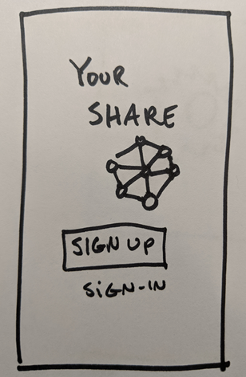
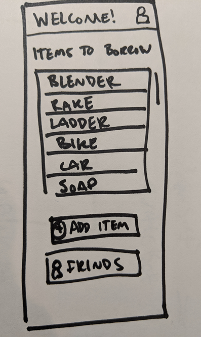
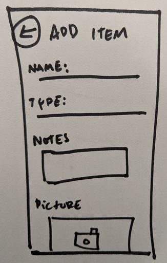

*This is a minimal viable interview guide. Depending on where you're at in the design phases and app mockup you may have more or less concept testing and more or less usabiltiy testing*

# Sample interview guide

## Prepare

### Goals

* Learn more about the barriers people face sharing within their local community
* Test initial app concepts and basic usability

### Hypothesis

* H1: People are hesitant to share items today because there's no secure way to do so.
* H2: People are more likely to share items with their friends.
* H3: The app concept will be more convenient as a mobile app, on the go.

### Questions

Background questions

* Do you share items with your neighbors today?
* Would be comfortable sharing with your friends? Would you be comfortable sharing with nearby strangers? Why or why not?
* What items would you be interested in borrowing?
* What items would you be interested in lending?
* Do you participate in social media based sharing platforms? What do you like or dislike about that experience?

Supporting questions

* Why?
* Tell me more about what you meant by..."
* How did that make you feel?
* What do you think that will do?

Wrap up questions

* Would you be willing to try this experience and borrow and lend from neighbors? Why or why not?
* What would you be most excited to see with this experience? Or what would you want to see before you try it?

### Usability tasks

1. Create a new account
2. Find an item to borrow
3. Add an item

## During session

### Introduction

Thank you for taking the time today to test out our app. We're excited to hear your feedback. We're in a learning phase and you're honesty is very much appreciated. There is no right or wrong answer. I'm going to first ask you a few questions and then have you try out some app features.

### Background questions

We're exploring experiences based around community sharing -

* Do you share items with your neighbors today?
* Would be comfortable sharing with your friends? Would you be comfortable sharing with nearby strangers? Why or why not?
* What items would you be interested in borrowing?
* What items would you be interested in lending?
* Do you participate in social media based sharing platforms? What do you like or dislike about that experience?

### Prototype tasks

I'm now going to show you a few screens of the app. As I show you the screens narrate and share what you're seeing. Let me know if you have any questions.

1. You go to the app landing page and see this.
     - What do you think the app does?
     - How would you create a new account?
     - How would you sign into the existing account?

2. You're signed in.
      - What do you see here?
      - What actions do you think you can take?
      - How would you borrow an item?
      - How would you add an item?

3. You're going to add an item.
      - How do you add an item?
      - What fields would you be able to expect to customize?
      - What would you want to know about an item you're borrowing?

### Conclude

Thank you for your feedback on those screens. A couple questions to wrap up:

* Would you be willing to try this experience and borrow and lend from neighbors? Why or why not?
* What would you be most excited to see with this experience? Or what would you want to see before you try it?
