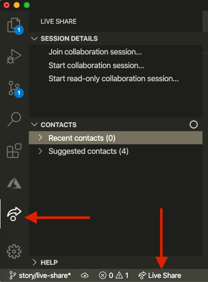
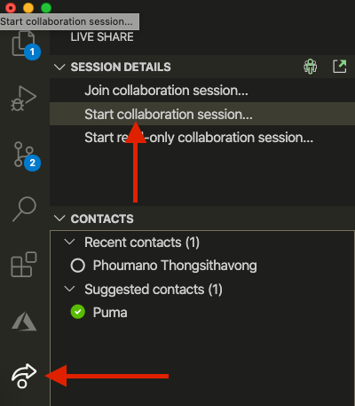
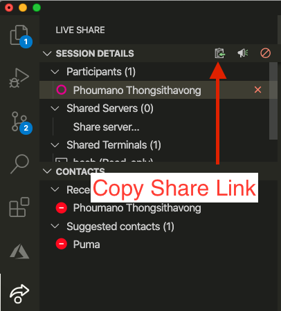
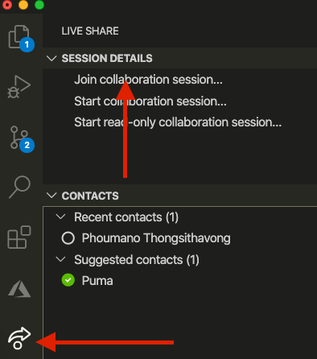
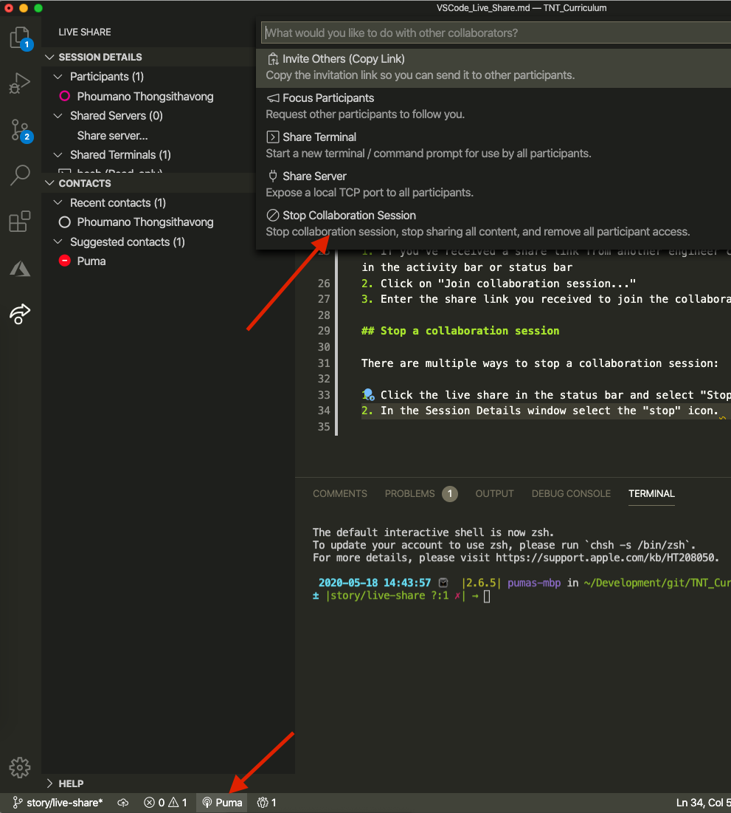
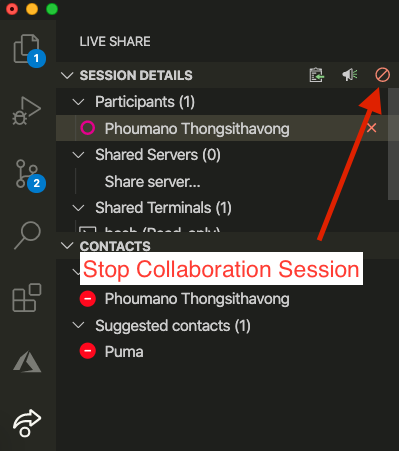

# VS Code Live Share

Pair programming is a great tool to overcome challenging problems or for onboarding onto a new code base. Working with other engineers is a key part of being part of a cohesive and effective team. When in-person pair programming isn't available remote pairing is a solid alternative.

This reference will allow engineers to use VS Code Live Share to pair program remotely by starting or joining a collaboration session.

Table of Contents:

* [Install VS Code Live Share](##install-vs-code-live-share)
* [Start a Collaboration Session](##starting-a-collaboration-session)
* [Join a Collaboration Session](##joining-a-collaboration-session)
* [Stop a Collaboration Session](##stop-a-collaboration-session)

## Install VS Code Live Share

1. VS Code Live Share download here: [https://marketplace.visualstudio.com/items?itemName=MS-vsliveshare.vsliveshare](https://marketplace.visualstudio.com/items?itemName=MS-vsliveshare.vsliveshare)
2. Once installed you'll see another item in the left hand Activity Bar and the Status Bar

    

## Starting a collaboration session

1. Click on either the live share in the activity bar or status bar

    

2. Click "Start collaboration session..."
    * If it's your first time it will require you to sign in with your Microsoft account or Github account. After signing in you will be redirected back to VS Code.

    

3. You'll see a dialog window with the status of "Starting Collaboration Session" and then a message indicating an invite link is copied onto your clipboard.
    * Once you've started a collaboration session you can always get the share link by clicking on the Live Share in the status bar and selecting the option titled "Invite Others (Copy Link)" or the "Copy Collaboration Link" in the Session Details window.

    

4. Send the share link to others and start collaborating!

## Joining a collaboration session

1. If you've received a share link from another engineer click on the Live Share extension in the activity bar or status bar
2. Click on "Join collaboration session..."

    

3. Enter the share link you received to join the collaboration session

## Stop a collaboration session

There are multiple ways to stop a collaboration session:

1. Click the live share in the status bar and select "Stop Collaboration Session"

    

2. In the Session Details window select the "stop" icon

    
