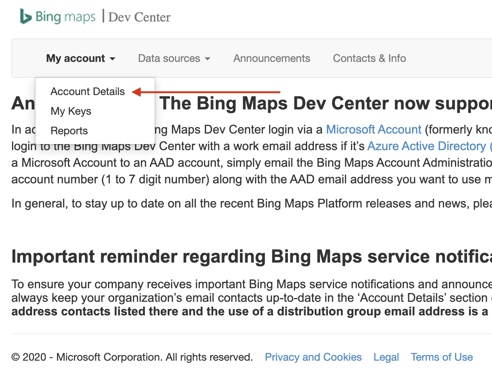
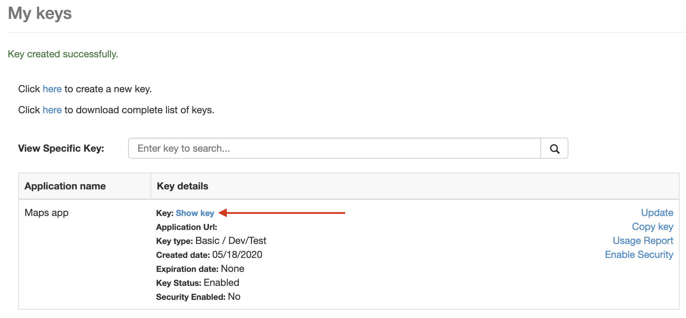
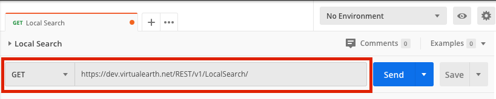
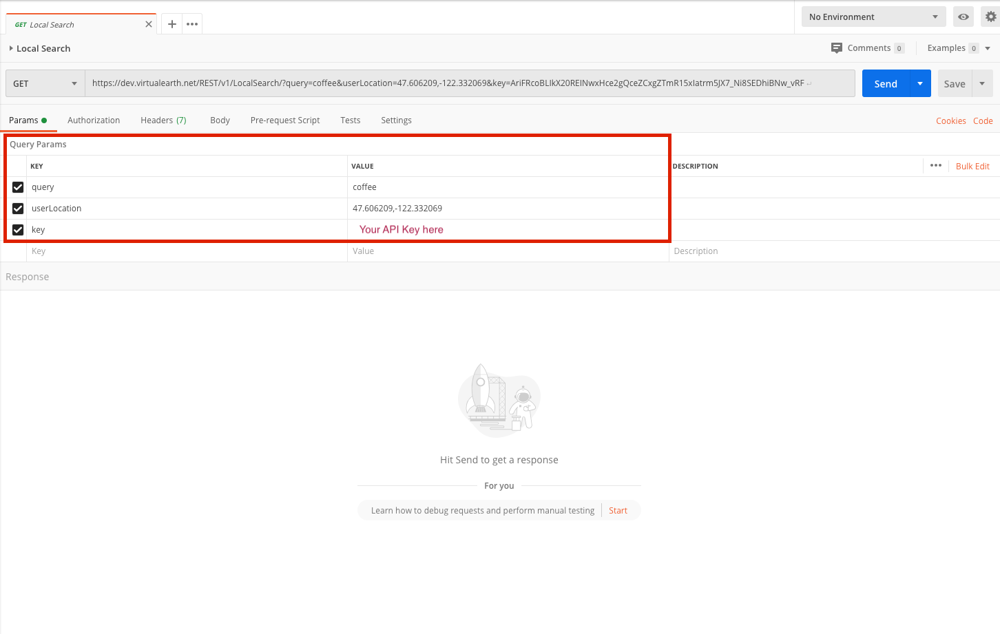
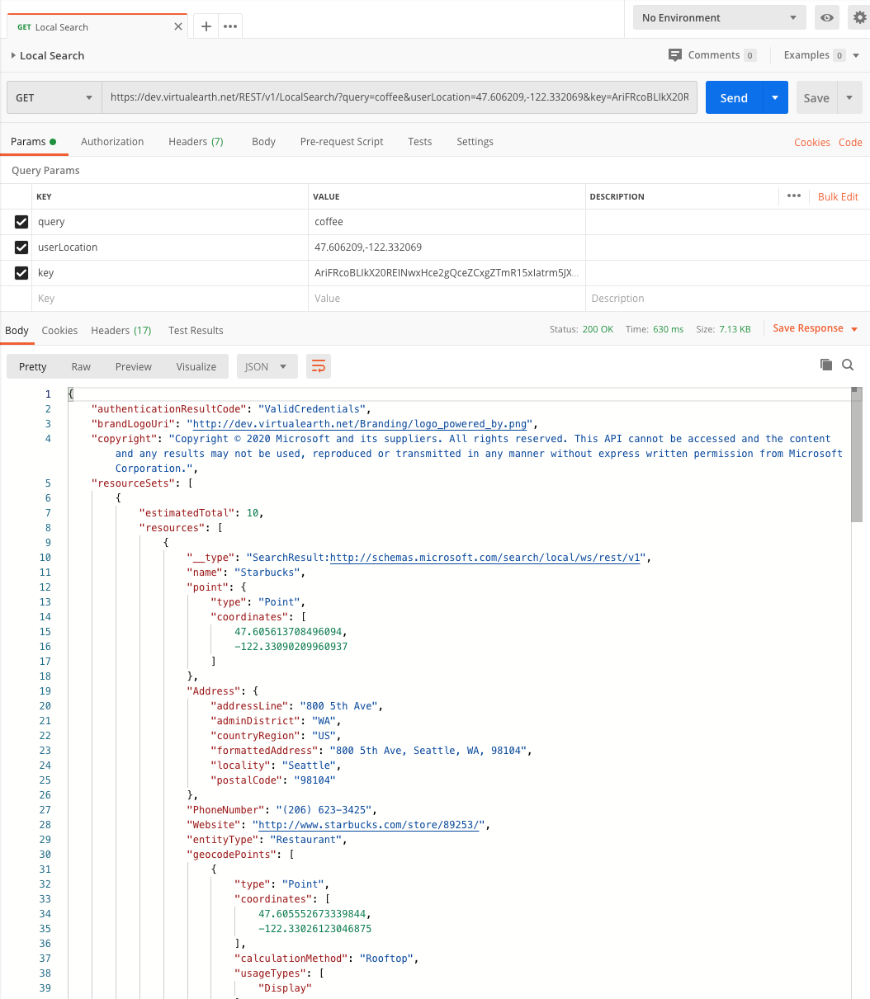

# Maps API

Connecting to a Maps API will be an essential skill when working on apps which need Map data to enhance the user experience.

## Learning objectives

* TNTs will understand how to create an API key
* TNTs will understand how to use a REST API
* TNTs will understand how to use POSTMAN
* TNTs will understand how to use a REST API in a React App

## Time required and pace

Total time: 1.3 hours

* 10 minutes - What is an API key
* 10 minutes - Creating an API key
* 15 minutes - How to use an API key
* 45 minutes - Practice

## Background / review

Get Started With Bing Maps - [https://www.microsoft.com/en-us/maps/create-a-bing-maps-key/](https://www.microsoft.com/en-us/maps/create-a-bing-maps-key/)

Bing Maps Dev Center - [https://www.bingmapsportal.com/](https://www.bingmapsportal.com/)

API Key Definition - [https://en.wikipedia.org/wiki/Application_programming_interface_key](https://en.wikipedia.org/wiki/Application_programming_interface_key)

Download Postman - [https://www.postman.com/downloads/](https://www.postman.com/downloads/)

Bing Maps API - [https://docs.microsoft.com/en-us/bingmaps/rest-services/](https://docs.microsoft.com/en-us/bingmaps/rest-services/)

## Lesson details

## What is an API Key (10 min)

* Explain what an API key is and why it's needed - It's a unique identifier used to authenticate a user or app
  * Briefly explain the difference between authorization and authentication - Essentially it's "What you can do" vs "Who you are"

* Go over other several types of authentication
    1. Basic Authentication
    2. OAuth 2.0
    3. JSON Web Tokens (JWT)

## Creating an API key (10 min)

Using Bing Maps Dev Center we will create an API key to connect to Bing Maps API

* Sign in to Bing Maps Dev Center [https://www.bingmapsportal.com/Account/Register](https://www.bingmapsportal.com/Account/Register)
  * NTs may have to create a new account, if so then create a new account
* After signing in go to My account > My keys

    

* Fill out the "Create key" form with the following values
  * Application name - Your app name
  * Key type - Basic
  * Application type - Dev/Test
* Click "Create" button
* After your API key is created you will be able to view the API key

    

## How to use an API key

Developers who need to test an API with the required authentication need a quick way to test their API key. A quick way is to use an HTTP client, such as Postman. Let's use Postman to use our API Key to view a JSON response from Bing Maps Local Search API.

### Use POSTMAN to use our API Key

1. Download Postman [https://www.postman.com/downloads/](https://www.postman.com/downloads/)
2. Create an HTTP GET Request
    * Select HTTP method as GET
    * API URL is `https://dev.virtualearth.net/REST/v1/LocalSearch/`

    

    * Fill out the query params with the following values

    

3. Click "Send" and you should see a response from the API

    

### Using the API key in an app

The stretch topic [API Requests](./API_Requests.md) goes more in depth but here is the code snippet NTs need to use their API key to connect to the Bing Maps Local Search API.

Example of how to connect to an API service using a browsers built in `fetch` API

```js
fetch("https://dev.virtualearth.net/REST/v1/LocalSearch/?query=coffee&userLocation=47.606209,-122.332069&key={API_KEY_HERE}")
      .then(res => res.json())
      .then(
        (result) => {
          // Display results
        }
      )
```

## Practice: Creating an API key and connecting to Bing Maps API

1. Create a new React App
2. Follow the steps above to create an API Key
3. Use POSTMAN to test the API key using the [Local Search API](https://docs.microsoft.com/en-us/bingmaps/rest-services/locations/local-search)
4. Add a component in the React App to fetch results using `fetch`

## Stretch

1. Using the [Local Search API](https://docs.microsoft.com/en-us/bingmaps/rest-services/locations/local-search) create an input field so the user can enter a search term and display the results in a List component
    * Fluent UI List [https://developer.microsoft.com/en-us/fluentui#/controls/web/list](https://developer.microsoft.com/en-us/fluentui#/controls/web/list)
