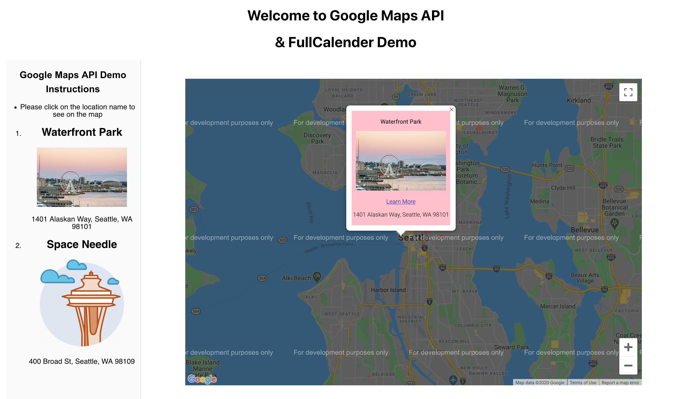
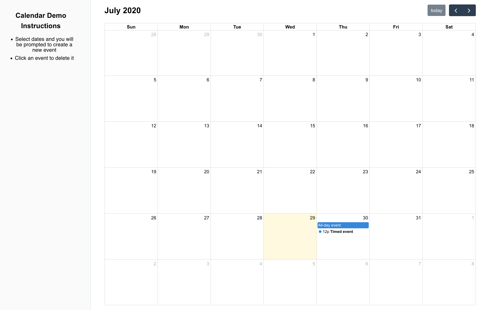

# Calendar and Maps APIs

Connecting to a Maps API will be an essential skill when working on apps which need Map data to enhance the user experience.

## Learning objectives

* TNTs will understand how to create an API key
* TNTs will understand how to evaluate and choose the correct API from what is available on the marker
* TNTs will understand how to use Google Javascript API and others
* TNTs will understand how to implement different functionalities to interact with the map

## Time required and pace

Total time: 2.5 hour

* 30 minutes - [**Pre-session**](https://github.com/tnt-summer-academy/Curriculum/wiki/%5BStretch%5D-Maps-and-Calendar-API): background learning, research, and investigations
* 60 minutes - **Instructional Session**
    * 15 minutes - explain: how to evaluate and choose the correct API for your project
    * 35 minutes - explore: create and use react google maps API in a project
    * 10 minutes - create and use FullCalender in a project
* 10 minutes - [**Post-session**](https://github.com/tnt-summer-academy/Curriculum/wiki/%5BENG2.0%5D-Remote-Repositories-and-GitHub): review, and investigate

## Pre-session (60 minutes)

Prepare for the session [here](https://github.com/tnt-summer-academy/Curriculum/wiki/%5BStretch%5D-Maps-and-Calendar-API)

## Session (60 minutes)

Please post the pre-session brainstorming two questions answers on the session chat area for open discussion
* **What are the different Maps APIs you researched and tried?**
* **How do you choose the API that you will start to use?**

There are a large number of React Maps API libraries to choose from, each with a different history, focus, strengths and limitations. Some things to look for include:
- **Built for React** - some JavaScript libraries can be used with React, but are not built for React. This can lead to integration issues and challenges with installation
- **TypeScript Support** - look for libraries that offer fully-supported TypeScript definitions, examples and demo projects to avoid surprises later on.
- **Open Source Licensing** - Not all libraries are open source or free to use. Look for MIT Licensing for the most flexibility. Note that some free libraries offer paid support or charge for custom themes.
- **Clearly Supported** - Pay attention to when the library's GitHub repo was last updated; look for clear documentation, well-thought out examples, and sample projects.
As a product owner or a developer you need to be ready to talk about why in a meaningful way, how it meets a need and why this product over other similar products.

### Session set up

We are going to dive deep with one API library in particular for the session demonstration example.
We are going to use [**react-google-maps-api**]()

#### Installation Process and Gotchas

#### NPM installation

Look for the "Getting Started" or "Installation" section on the [library website](https://react-google-maps-api-docs.netlify.app/#section-introduction) to find the npm library name. You can also [search npm packages directly](https://www.npmjs.com/) for "React" components by name.

***Install @react-google-maps/api***

```
npm install --save @react-google-maps/api
# or
yarn add @react-google-maps/api
```

##### TypeScript Errors

When trying to use a general React UI library, watch for TypeScript compile to e-time errors.
You can add type to some of the libraries by running

```
yarn add -D @type/library-name
```

You may be able to work around these by adjusting some of the tsconfig.json compiler options, like setting`"noImplicitAny": false`

#### Code Walkthrough - react-google-maps/api

Our code demo aim is to implement a small web app to list some of the recommended places to visit in Seattle and show where there are located on the map.



### Code snippets for implementation

Check code details ***SimpleMap.tsx*** file

1. Create a class component
2. To render a google map in your component you need to
    * LoadScript and GoogleMap
    * The two basic components required to load a simple map are:

LoadScript - Loads the Google Maps API script
GoogleMap - The map component inside which all other components render

``` JSX
interface defaultPosition{
  lat:number,
  lng:number
}
interface IState{
  center:defaultPosition,
  defaultZoom:number,
}
class MyComponents extends Component<{}, IState> {
  constructor(props: any, state: IState){
  super(props, state);
  this.state = {
    center:{
      lat: 47.6062,
      lng: -122.3321
  },
  defaultZoom:12,
  };
  };

  render() {
      return (
      <LoadScript
        googleMapsApiKey="Add your API key here"
        libraries={["include any special libraries that you need access to such as places"]}
      >
      <GoogleMap
      mapContainerStyle={mapContainerStyle}
      zoom={defaultZoom}
      center={center}
    >
{/*{ /* Child components, such as markers, info windows, etc. */ }
    </GoogleMap>
  </LoadScript>
      )
    }
```

3. Add the necessary import from the library
`import { GoogleMap, LoadScript} from '@react-google-maps/api';`


4. Add a marker on a the map center location
Checkout what are other options that you can add to  a marker

``` JSX
<Marker 
    onLoad={this.onLoad}
    position={this.state.center}
/>
```

5. Add infoWindow for the marker

``` JSX
 <InfoWindow
    position={this.state.center}
    >
    <div style={{ backgroundColor: 'pink', opacity: 0.75, padding: 12 }}>
        <div style={{ fontSize: 16 }}> 
        <h1>{this.state.center.lat + ' ' + this.state.center.lng}</h1>
        </div>
   </div>
</InfoWindow>

```
6. update the import
`import { GoogleMap, LoadScript, Marker, InfoWindow} from '@react-google-maps/api';`

6. Add multiple marker
* Create a info window instant 
    * Add an InfoFlag, places and myInfoWindow to the class state interface
    ```JSX
    interface places{
        position:defaultPosition
        id: number,
        name: string,
        description: string,
        imgSrc:any,
        address:string,
        moreInfo:string,
        type:string,
    }

    {
    infoFlag:boolean,
    places: Array<places>, 
    myInfoWindow?: places,

    }
    ```
    
     * Initialize in the constructor

``` JSX
  infoFlag:false
// App Places Data to render on the map
  places:[
    {
      id: 1, 
      position: { 
        lat: 47.6070, 
        lng: -122.3418 
      }, 
      name: "Waterfront Park", 
      description: "Waterfront Park is a public park on the Central Waterfront, Downtown, Seattle, Washington, USA. Designed by the Bumgardner Partnership and consultants, it was constructed on the site of the former Schwabacher Wharf.",
      imgSrc:"https://www.touropia.com/gfx/d/tourist-attractions-in-seattle/seattle_downtown_waterfront.jpg?v=1", 
      address:"1401 Alaskan Way, Seattle, WA 98101",
      moreInfo:"https://en.wikipedia.org/wiki/Waterfront_Park_(Seattle)",
      type:'info'
    },
    ...
  ]
  ```

* Create an infoWindow object

```JSX
let infoWindow;
    if (this.state.infoFlag) {
      infoWindow =
        <InfoWindow
          onLoad={this.onLoad}
          onCloseClick={() => { this.setState({ infoFlag: false }) }} //Keeps infoWindow closed before Click
          position={this.state.myInfoWindow?.position} //Puts infoWindow on location position {lng and lat }
        >
          {/* Show selected Data on the info window */}
          <div style={{backgroundColor: 'pink', opacity: 1, padding:3 }}>
          <p><b>{this.state.myInfoWindow?.name}</b></p>
          <p> { <p></p>}</p>
            <p><a href={this.state.myInfoWindow?.imgSrc}>Learn More</a></p>
            <p>{this.state.myInfoWindow?.address}</p>
          </div>
        </InfoWindow>;
    } else {
      infoWindow = null;
    }
```

 * Use map to create a marker for each place from your places object 

 * Call the info window instant after the marker tag

```JSX
       {this.state.places.map(myPlace => (
          <Marker 
          label={labels[myPlace.id-1]}
          key={myPlace.id}
          onLoad={this.onLoad}
          position={myPlace.position}
          onClick={() => { this.updatePlace(myPlace) }} 
        /> 
          ))}
          {/* Show my info window instant */}

          {infoWindow}
```
``` JSX
private updatePlace = (loc: places) => {
  this.setState({ myInfoWindow: loc, infoFlag: true }); // update the InfoWindow to the value of the current marker
}
```

7. change the map state with onClick action
``` JSX
onClickChange= (e:MouseEvent) => {
    this.setState(state => ({
      center: {                   // object that we want to update
          ...state.center,    // keep all other key-value pairs
          lat: 47.608013,
          lng: -122.335167       // update the value of specific key
      },
      zoom:state.zoom
  }))
  console.log("my new center is"+ this.state.center.lat +" "+ this.state.center.lng)
}
```

#### Code Walkthrough- FullCalendar API
Check Calendar.tsx and event-utils.tsx for code details



## Calendar and Maps API Code Demo

[Sample code for demo](https://github.com/tnt-summer-academy/Samples/tree/main/Stretch/google-maps-api-and-calendar)
