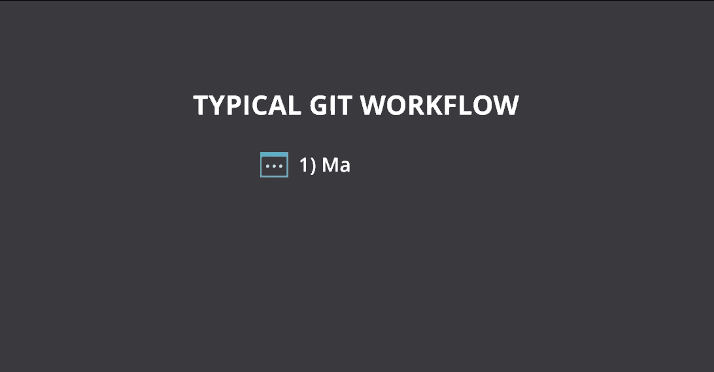
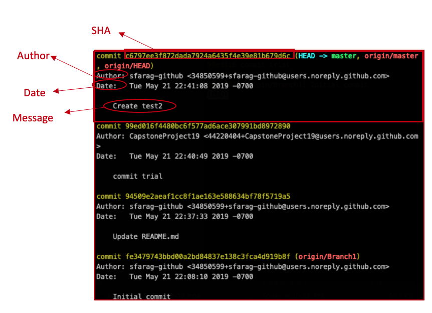

# Introduction to Git and local workflow

This lesson introduces the fundamentals of the Git workflow, Git Bash, and VS Code Git support for local repositories.

## Learning objectives

* TNTs will understand what is source control and why we need it.
* TNTs will learn how their previous code or doc collaboration experience maps to aspects source control.
* TNTs will be able to work with a local repository using Git.

## Time required and pace

Total time: 2.5 hour

* 60 minutes - [**Pre-session**](https://github.com/tnt-summer-academy/Curriculum/wiki/%5BENG1.2%5D-Intro-to-Git-and-local-workflow): background learning, research, and investigations
* 60 minutes - **Instructional Session**
    * 10 minutes - engage: source control and you
    * 15 minutes - explain: recap git basics and best practices
    * 10 minutes - explore: create repo and edit in VS Code
    * 10 minutes - elaborate: best practices, trouble spots and talk about 
* 30 minutes - [**Post-session**](https://github.com/tnt-summer-academy/Curriculum/wiki/%5BENG1.2%5D-Intro-to-Git-and-local-workflow): review, and investigations

## Pre-session 

View the pre-session [here](https://github.com/tnt-summer-academy/Curriculum/wiki/%5BENG1.2%5D-Intro-to-Git-and-local-workflow)

## Lesson details

## Source control and You (10 min)

1. In groups have NTs discuss the following questions:
   * Have you ever worked on a code project or a document with other people? How did you share? Google doc? Emailing? GitHub?
   * When working with other people on code or project, what has gone wrong? Have you gotten versions of the document mixed up? Have you lost changes?

2. Groups come back together and share.

3. Wrap up and connect to source control.
   * Source control enables code collaboration
   * Makes large projects with 1,000s of people possible
   * Makes it easy to manage your own changes and work
   * Source control allows you to try things without fear
   * Git takes practice

## Recap git basics and best practices (5 minutes)

1. Why Git?
   * There are other version control systems. There are a number of Version Control Systems out there. This alone should prove that version control is incredibly important. Examples
        * [Git](https://git-scm.com)
        * [Subversion](https://subversion.apache.org)
        * [Mercurial](https://www.mercurial-scm.org)
    * Git is the most popular and an industry standard.
   * It has some advantages over a centralized system, which has a single copy of the code:
       * It's quick to take action on your own copy
       * It works locally, on your own computer, and offline
       * It makes having multiple branches, parallel worlds of code, easier

       

2. Git Gotchas
   * Git can mean several things - the name of the source control technology, the functionality built into VS Code, the file formats and protocols that underlie the system.
   * It’s both powerful (because it’s open-ended), plentiful (because it’s open source), and sometimes hard to use (because it’s open-ended).
   * It takes practice, it's a learned skill, it's not intuitive - ask your coaches about their Git disasters - everyone has a story.

## Git Demo Using Git Bash/ VS Terminal and VS Code (15 min)

### Demo: Using Git Bash : 

1. Creating new repo and initial commit. The flow for using git starts with creating a directory (folder). The cycle as changes are made is `add` and `commit`. Small chunks as you go.

    * Configure your git
      * `git config --global user.email "youremail"`
      * `git config --global user.name "yourname"`
    * `mkdir SampleApp` - create new folder named SampleApp
    * `cd SampleApp` - move to the project folder
    *  `git init` - initialize the repository
    *  `touch index.html` - create a new file
    * `git status` - view the repository status
    * `git add  .` - stage the files to commit and tell get what files to track, "." selects all the new files or files with changes
    * `git commit index.html -m "New index file"` - add the changes to the repo with the named file, "-m" indicates message included

    *Remember*

    

### Demo: Git in VS Code
1. Open the workspace in VS Code. VS Code has git support built in. It doesn't have all the commands of Git Bash but is convenient when working in VS Code.

2. Click in the Activity Bar, the Source Controlog log, and Initialize the repository. 

3. Add an index.html file (File/New) and fill it with some starter code:

        <!doctype html>
        
            <html lang="en"> 
                <head>
                    <meta charset="utf-8">
                    <title>Blog Project</title>
                    <meta name="viewport" content="width=device-width, initial-scale=1"> <meta name="description" content="">
                    <link rel="stylesheet" href="css/app.css">
                </head>
                <body>
                     
                </body>
            </html>
        

4. Follow the git workflow. We need to complete stagging for the changes
    * Invoke the command either View -> Command Palette or `Ctrl+Shift+P. (Cmd+Shift+P for Mac OS)`
    * Type / select `"Git: stage all changes"`.
    

5. After stagging is Committing changes
    * Invoke the command pallette again and type / select "Git: commit"
    * Check out the changes in Git Bash with `git log`
    * Show the differnt between `git log` and git `log --oneline`

 

 6. Make some changes to index.html.

 7. Show the Source Control tab and the file diffs.

  
  
 8. Show how to read the git log view

### Best practices, trouble spots, and what's next

1. Git best practices
     * It takes practice
     * Keep commits light, [how to write good commit message](https://chris.beams.io/posts/git-commit/) 
     * It's good to save often and keep the change set small, it'll be easier to merge
     * Take a minute to review your changes before checking-in - more time will be spent on debugging, diff tools make it easier to quickly glance. Your teammates will thank you when it's time for them to review your merge request.
     * Use .gitignore when needed

2. What's next?
     * How does this actually help if it's just local on my computer? Remote repositories are next! This week practice the basics of source control on your local machine. Next we'll dive into remote repositories, branching, pull requests, and merge conflicts.

### Exercise: Create repo and edit in VS Code (10 minutes)

This practice reinforces using the Git command line and VS Code together.

1. Start this practice by creating a new directory with Git Bash. Add two files.
2. Open the work space in VS Code and initialize the repository.
3. Edit one of the files with the code we completed in the last demo and stage the commit.
4. View the diff.
5. Commit!
6. Make another edit that add the header tag just inside the body tag in index.html

        <header>
            <h1>My first webpage</h1>
        </header>

7. Stage and commit.
8. Post the Git status to teams.
9. Room discussion - What worked? Where did you get stuck? How we can address trouble areas

# Post-session and Stretch

View the post-session [here](https://github.com/tnt-summer-academy/Curriculum/wiki/%5BENG1.2%5D-Intro-to-Git-and-local-workflow)

