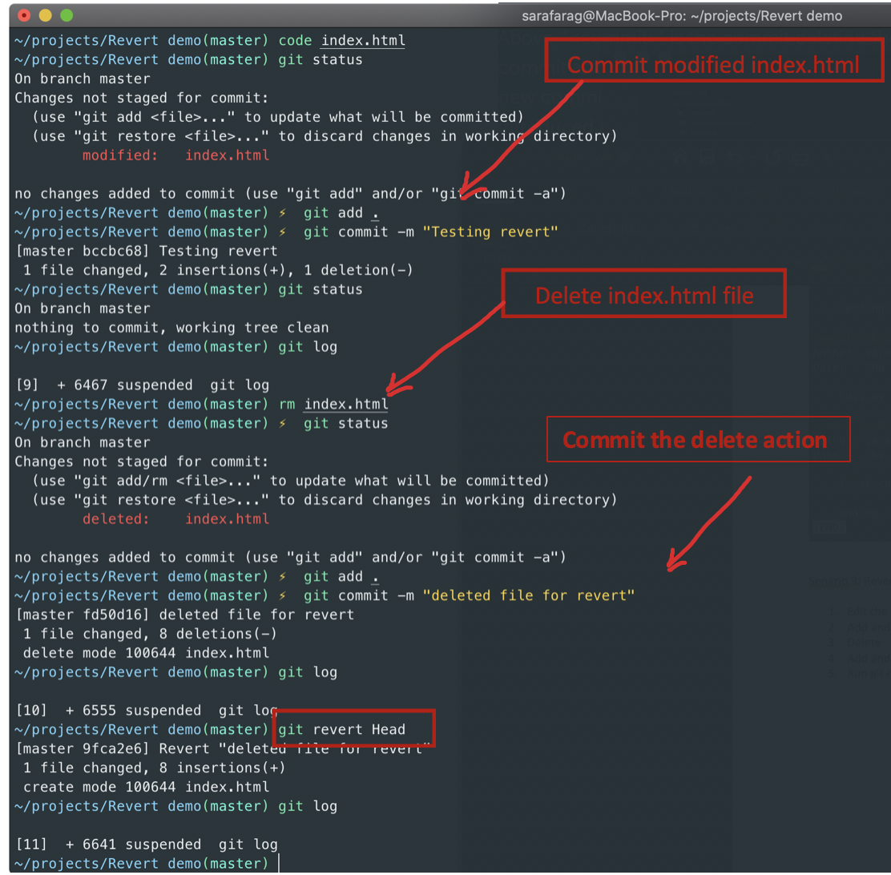

# Git undoing and backtracking

This lesson reiterates the basics for fixing things when something goes awry with Git. It also covers Live Share.

## Learning objectives

* TNTs will understand what can go wrong with Git.
* TNTs will learn strategies for fixing things with Git.
* TNTs will practice strategies for resolving issues with Git.
* TNT will learn about Live Share for code collaboration.

## Time required and pace

Total time: 80 minutes

* No pre-session
* 60 minutes - **Instructional Session**
    * 15 minutes - engage: practice explaining git
    * 20 minutes - explain: revisit tactics for backtracking and undoing with git
    * 15 minutes - explore and elaborate: specific activity
* 20 minutes - [**Post-session**](https://github.com/tnt-summer-academy/Curriculum/wiki/%5BENG1.5%5D-Git-undoing-and-backtracking): review, and investigations

## Pre-session

None

## Background / review

* Git Bash
* VS Code

## Lesson details

### Practice explaining Git (15 minutes)

Thinking through how Git works and explaining to others is a good way to cement Git understanding. Git is a very common tool and skill in the industry. Questions related to git may come up in an interview.

1. In your team, each person select one of the following questions to answer:
    * What is Git?
    * What are some advantages of using Git?
    * How can you create a repository in Git?
    * What is `git add` used for?
    * What is a commit message?

2. Write a two-part answer. Part A, the answer to the question. Part B, an example that elaborates on the definition.
    * Question: What is the difference between Git and GitHub?
    * A: Git is a version control system that manages and tracks source code history. GitHub is a cloud-based hosting services for managing Git Repositories.
    * B: Git can be used with local repositories and other cloud hosting repositories like GitHub, GitLab or BitBucket. The cloud hosting services support Git and introduce more features that support team development life cycle, with a graphical user interface, control, and task-management tools.

3. Post your answer into your team and discuss.

### Revisit tactics for backtracking and undoing with Git (30 minutes)

We'll cover three scenarios: amending a commit, recovering a deleted file, and reverting a commit.

1. **Demo: Amending a commit**
    1. If your wrote the wrong thing in the last commit message, use "--amend" to overwrite the message. `git commit --amend -m "new message"`
    2. If you have staged changes, they will be added to the previous commit as well. In most cases it's better to create a new commit then amend when it comes to code changes.

2. **Demo: Recovering a deleted file**
    * ***I deleted a file but didn’t commit***
      You deleted a file, and immediately realized it was a mistake?  
      If a file is accidentally deleted from a repository it can be recovered with `git checkout`. Using a specific file name will pull the file back from the index into the working tree.

      

    * ***I deleted a file and committed the deletion***

        

        You made a commit deleting a file, but then realized you wanted to keep the file around after all? 
        Do a reset to go back to the state before your commit (be careful: the "--hard" option means the command will discard changes to tracked files after the specified commit — you can also leave this option out in which case the file deletion will show up as an un-staged change along with any other changes you’ve made in your working tree. The file can then be restored as in the previous scenario)
    `$ git reset --hard HEAD~1`

    (Note: this presumes you haven’t already pushed your commit to a remote — this will be covered later next week.

    

    * ***I committed the deletion and then I did more commits***

      If you deleted a file, committed, then continued work and did more commits, only to find that deleting the file was a mistake, Git still has you covered! 
      
      
      
      To find the right commit, first check the history for the deleted file: `$ git log -- <filename>` 

      

      You can either work with the last commit that still had the file, or the commit that deleted the file. In the first case, just checkout the file from that commit: 

      `$ git checkout <commit hash> -- <filename>`

      In the second case, checkout the file from one commit before that:

      `$ git checkout <deletion commit hash>~1 -- <filename>`

      

3. **Demo: Reverting a commit**

   

    Sometimes you just need to go back to a previous version. Refactoring some code didn't head the direction you thought. You accidentally deleted some code that you actually needed. The layout changed in a way you didn't predict and you want a fresh take at it. Don't worry, you've been committing your work in strong reasonable chunks.
    `git revert HEAD` makes a change that's exactly the opposite of the last commit.

    ***See below demo scenario steps in picture***

     

***Note:*** `git revert HEAD` do the same as `git reset --hard HEAD^` but the second removes the most recent commit and history

### Recap for the common scenarios
 * I deleted a file but didn’t commit: use `$ git checkout HEAD <filename>`
 * I deleted a file and committed the deletion: use `git revert HEAD` or `$ git reset --hard HEAD~1` the second removes the most recent commit and history
 * I committed the deletion and then I did more commits: 
    * `$ git log -- <filename>` 
    * work with the last commit that still had the file, `$ git checkout <commit hash> -- <filename>`
    * or work with the commit that deleted the file, checkout the file from one commit before that: `$ git checkout <deletion commit hash>~1 -- <filename>`

### Introducing Live Share in VS Code

* [Download VS Code Live Share extension](https://marketplace.visualstudio.com/items?itemName=MS-vsliveshare.vsliveshare-pack)
* Show Live Share [instruction details](https://github.com/tnt-summer-academy/Curriculum/blob/main/Reference/VSCode_Live_Share.md)
* Demo how to start and watch this short [video](https://www.youtube.com/watch?v=9QXwSg9-2qQ&feature=emb_title)

## Post-session

View the post-session [here](https://github.com/tnt-summer-academy/Curriculum/wiki/%5BENG1.5%5D-Git-undoing-and-backtracking)
