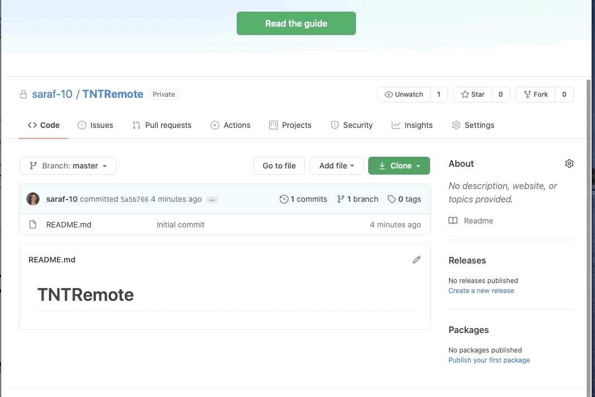
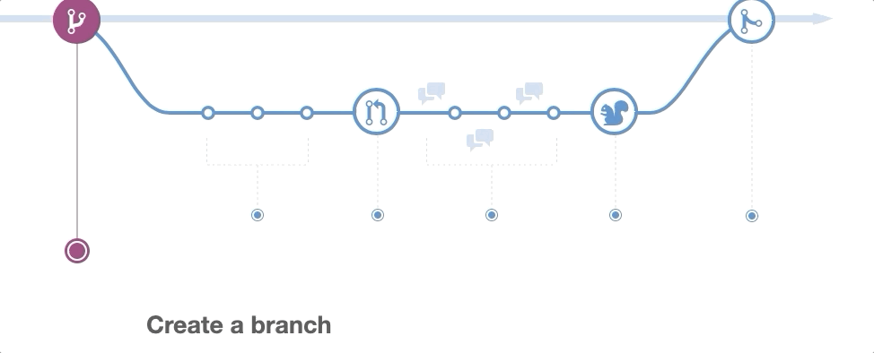
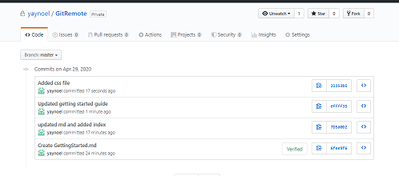

# Remote repositories and GitHub

This lesson introduces the core concepts for collaborating with Git and working with a remote repository.

## Learning objectives

* TNTs will understand the basic workflow for how multiple people work with Git.
* TNTs will understand why using branches and practice branching.
* TNTs will be able to clone a repository, make a pull request, push changes.
* TNTs will learn how to create and use repositories on GitHub.

## Time required and pace

Total time: 2.5 hour

* 60 minutes - [**Pre-session**](https://github.com/tnt-summer-academy/Curriculum/wiki/%5BENG2.0%5D-Remote-Repositories-and-GitHub): background learning, research, and investigations
* 60 minutes - **Instructional Session**
    * 20 minutes - explain: recap learning
    * 30 minutes - explore: create and use a repo on GitHub
    * 10 minutes - elaborate: review trouble spots
* 30 minutes - [**Post-session**](https://github.com/tnt-summer-academy/Curriculum/wiki/%5BENG2.0%5D-Remote-Repositories-and-GitHub): review, and investigate

## Pre-session (60 minutes)

Prepare for the session [here](../../../wiki/[ENG2.0]-Remote-Repositories-and-GitHub)

## Session (60 minutes)

### Session set up

* GitHub - Be ready to make and clone a remote repository

### Recap cloning and pull requests (30 minutes)

1. The learning module of the pre-session introduced the basics of cloning a repository and contributing to a repository using `git clone` and `git pull`. These are the building blocks for collaborating with Git and working with a remote repository.

<table style="border: none">
    <tr align="center">
        <td> </td>
    
</tr>
</table>

2. It's called a "pull request" because it's asking the main branch to pull in the changes.

3. **Demo:** Create a new repository in GitHub and clone it using the integrated terminal or Git Bash

We'll now walk through the process of cloning a repository from GitHub. We'll be creating a private repository in our own accounts.

1. [Go to GitHub](https://github.com/) and create a new (private) repository.
2. Make an initial commit by creating a Readme file.

<table style="border: none">
    <tr>
        <td> </td>
        <td></td>
    </tr>
</table>

3. Clone the remote repository to your local directory using `git clone` followed by the URL provided by GitHub.
 4. Show the folders and open the workspace in VS Code. You can also go in the directory and write `code .`

<table style="border: none">
    <tr align="center">
        <td> </td> 
 </tr>
</table>

4. **Demo:** Clone from VS Code

    1. It's also possible to clone a repository from VS Code.
    2. Open the palette with Cmd+Shift+P for Mac OS / Ctrl+Shitf+P for Windows.
    3. `Git: clone` prompts for a URL. You can paste the one from GitHub.

5. **Demo:** Make changes in VS Code and push changes

    1. With the folder open in VS code, add a new file and make changes to the existing file.
    2. In VS Code integrated terminal, then  `git add .` to stage the files.
    3. `git commit -m "yourmessage"` to create the commit. The changes are now committed locally.
    5. `git remote -v` to know what remote branches are available on your local (here `origin`).
    6. `git push origin master` to push the changes to the remote repo.
    7. Check the remote repository in GitHub.

6. **Demo:** Create a branch and push work to this branch
    1. Create a new branch
        - Two-step method: `git branch NEW-BRANCH-NAME` creates the branch and `git checkout NEW-BRANCH-NAME` switch to the new branch
        - There’s a shortcut to create and checkout a new branch at once. You can use the -b option (for branch) with git checkout. The following commands do the same thing: `git checkout -b NEW-BRANCH-NAME`
    2. Edit, add and commit your files.
    3. Push your branch to the remote repository: `git push -u origin feature_branch_name` and check the remote repository in GitHub.
         - the `-u` flag (upstream) when you make your first push to track a remote branch
    4. Pull from the remote branch: `git pull`
    5. View the branches
        - To view the branches in a Git repository, run the command: `git branch`
        - To view both remote-tracking branches and local branches, run the command: `git branch -a`
    6. Rename a branch
        - To rename a branch, run the command: `git branch -m OLD-BRANCH-NAME NEW-BRANCH-NAME`
        - Alternative `git branch --move OLD-BRANCH-NAME NEW-BRANCH-NAME`
    7. Delete a branch
         - Git won’t let you delete a branch that you’re currently on. You first need to checkout a different branch, then run the command:
        - `git branch -d BRANCH-TO-DELETE`
        - Alternative: `git branch --delete BRANCH-TO-DELETE`

7. **Demo:** Create pull request from GitHub

8. What is next? Introduce GitHub workflow

<table style="border: none">
    <tr align="center">
        <td> 
    </td> 
 </tr>
</table>

You can also read more about it from [here](https://guides.github.com/introduction/flow/)

9. Poll for questions

### Create and use a repo on GitHub (20 minutes)

The goal is to create a repo on GitHub, clone the repository, make changes in VS Code and push the changes back to GitHub.

1. Create a new private repository on GitHub. Make an initial commit adding a file directly from the interface.
2. Clone the repository to your computer.
3. Open the folder in VS Code.
4. Add a new file in GitHub and edit this file.
5. Do some changes locally and commit them. Make a pull request.
6. View the changes in GitHub.
7. Continue making changes in VS Code. Check out the `git diff`. Check out the log using `git log` ,`git log --oneline` or `git log --oneline --graph --decorate --all` to see the tracking of the commits.
8. Share a screenshot of the commit history from GitHub.

<table style="border: none">
    <tr align="center">
        <td> </td>
    </tr>
</table>

### Review trouble spots (10 minutes)

In your Teams' team channel, discuss:

* What went well?
* What was difficult?

## Post-session

View the post-session [here](https://github.com/tnt-summer-academy/Curriculum/wiki/%5BENG2.0%5D-Remote-Repositories-and-GitHub)
