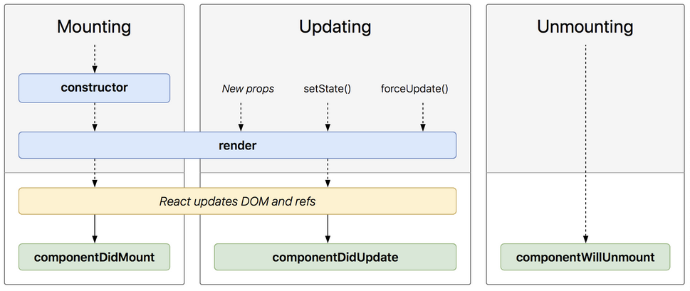

# Components

This lesson explores the purpose of a React component, how a component works and how its methods function

## Learning objectives

* TNTs will be able to describe the purpose of a React component
* TNTs will understand how a component's key methods function
* TNTs will practice building components

## Time required and pace

Total time: 2 hours, 45 minutes

- 60 minutes - **Pre-session**: background learning, research, and investigations
- 60 minutes - **Instructional Session**
  - 20 minutes - Components discussion in groups
  - 10 minutes – Review basic component's ideas
  - 10 minutes - Discuss component types
  - 10 minutes – Explain component's lifecycle
  - 10 minutes - Exercise Setup
- 60 minutes - **Post-session**: pair programming Exercise

## Pre-session (60 minutes)

*Prepare for the session* [here](../../../wiki/[ENG2.1]-Components)

## Session Details (60 minutes)

### Session Discussion (20 minutes)

In your team channels, discuss the following; be prepared to share an insight or example with the class

- Share examples of potential *Views* and *Components* you observed on websites
- Imagine your daily schedule as a set of components, e.g., Wake up, Exercise, Breakfast, .... Discuss as a group what might be examples of:
  -  **Stateless** and **stateful** components
  - Component **properties** vs. **state**
  - **Re-usable** components
  - Components made up of other components (**composition**)

### Component Description (10 minutes)

 At its simplest, a component is an object that returns a Javascript XML Element (JSX Element) which is rendered on the screen. Components are the building blocks of a React App, independent and reusable, much like HTML elements are for web pages.

#### Key Component Ideas

- Stateless Components
- Component Data: *Properties*,  *State*, *Children*
- Types of Components: *Class vs. Function*
- Component Lifecycle Methods

### Component Types (10 minutes)

#### Class Component

1. Render (required): This method returns the JSX element to be displayed by the class. It runs whenever the component's view updates.
2. Properties (optional): They are arguments passed into the component from its parent components. They cannot be changed by the component.
3. State (optional): They only exist within the components. Changing them causes the component to update.
4. Children (optional): Components nested inside the parent's JSX tags
5. Besided *render()*, class can include a constructor, lifecycle method calls and other additional methods.

#### Class Component Example

     class Tile extends React.Component<Properties, State> {
     
        render() {
    
            return (
             		
Hello World

            )
    
        	}
      }

#### Function Component

1. Originally simple, stateless components; expected to return the JSX element to be displayed.
2. Properties (optional): These arguments are passed in from the component's parent similarly to passing parameters to a function. They cannot be changed in the component.
3. UseState: A hook function that returns a state variable, giving function components a way to manipulate a state the way class components do.

#### Function Components Examples (two common syntax)

##### A. Standard Function Syntax

    function App(props:any) {
    
        return 
<h1>My App</h1> <Tile/>

    
    }

##### B. Lambda Function (Arrow Function) Syntax

    let App = (props:any) => 
<h1>My App</h1> <Tile/>

### LifeCycle Methods (5 minutes)

These are methods that are triggered through out a components existence from when they're constructed to when they are dismissed. 

[https://projects.wojtekmaj.pl/react-lifecycle-methods-diagram/](https://projects.wojtekmaj.pl/react-lifecycle-methods-diagram/)

### Exercise Setup - MyTNT App (15 minutes)

- Identify components and composition: Tile, Card, Item in the [MyTNT App](https://github.com/tnt-summer-academy/Exercises/tree/main/Week_2/ENG2.1-myTNT) layout

- Review GitHub process: Clone•Branch•Commit•Push•Pull Request 

- Explore Code
  - Identify Function and Class Components, props, state, and children
  - Examine use of TypeScript Interfaces with Properties and State
  - Examine the use of the state value **count** in the *Counter* component and **map** function
  - Review HTML/CSS including `<ul>`, `<li>` and `<a>` elements

## Post-session (60 minutes)

- Use pair programming in Live Share to complete the [*My TNT* Exercise](https://github.com/tnt-summer-academy/Exercises/tree/main/Week_2/ENG2.1-myTNT)
- Push your work to GitHub and submit a Pull Request (one per pair)

## Stretch

Continue coding on the *My TNT* Exercise Stretch Goals (See Exercises)

