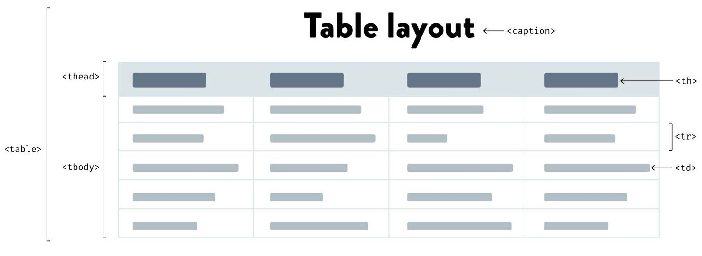
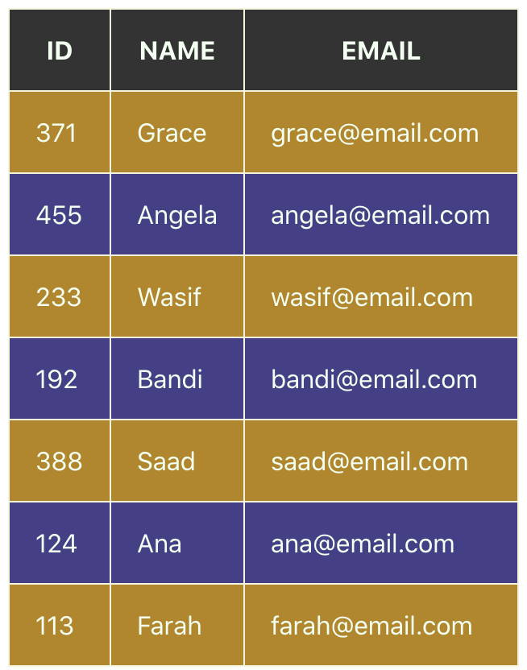
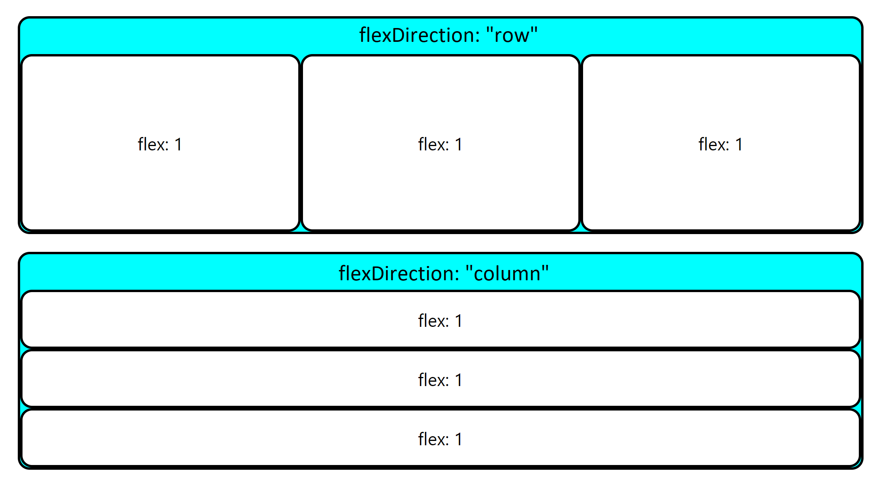
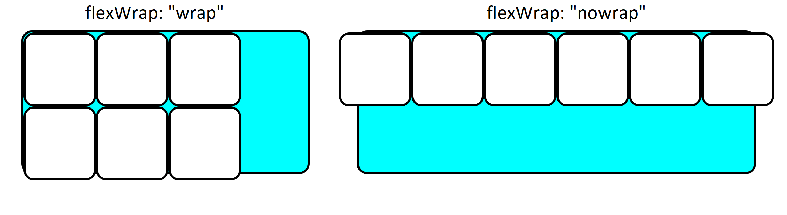
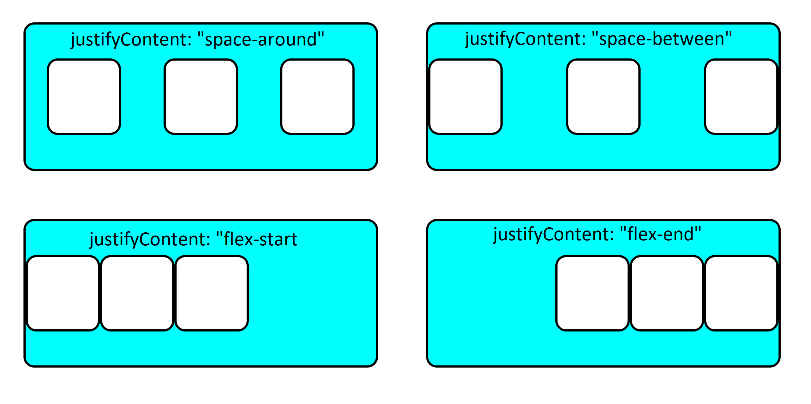
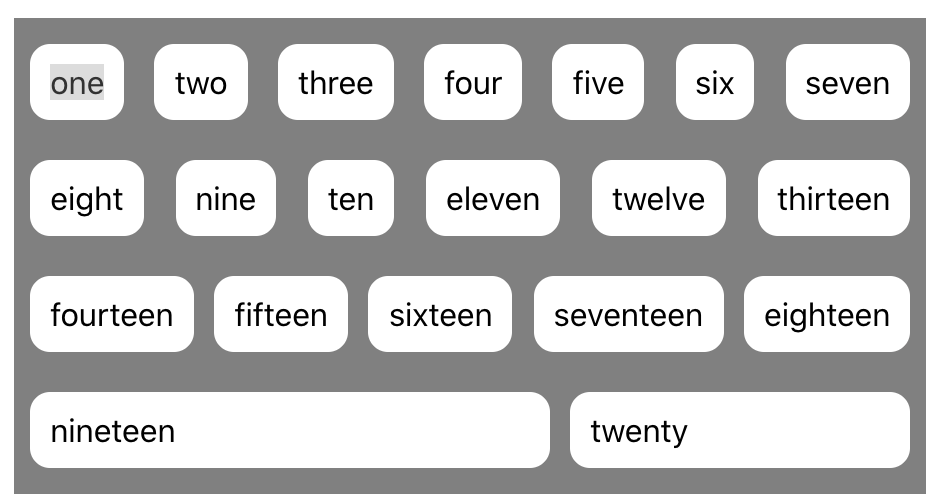

# View Component Layout

This lesson introduces how to create components that can display a variety of data and distribute space dynamically.

## Learning objectives

* TNTs will learn how to layout a table with React
* TNTs will understand the basics of CSS Flexbox layout
* TNTs will practice experimenting with and troubleshooting CSS in the browser

## Time required and pace

Total time: 2 hours, 30 minutes

- 45 minutes - **Pre-session**: background learning, research, and investigations
- 30 minutes - **Instructional Session**
  - 5 minutes - Discussion in groups
  - 10 minutes –  Layout using HTML Tables
  - 10 minutes - Layout using CSS Flexbox
  - 5 minutes - Exercise Setup
- 45 minutes - **Post-session**: pair programming Exercise

## Pre-session (45 minutes)

*Prepare for the session* [here](../../../wiki/[ENG2.2]-View-component-layout)

## Session Details

Components are most useful when their contents are generated on the fly based on the data passed to them. But how can we layout a web page when we don't know what the final content of the page will be? or when the content may continue to change as the user interacts with the page?

 Two useful options for working with this kind of dynamic layout are **HTML Tables** and **CSS Flexbox**.

### Session Discussion (5 minutes)

In your team channels, answer the following questions; be prepared to share an insight or example with the class

- Even though the website https://nytimes.com displays as rows and columns, why is it not created as an HTML table? What is a table?
- What is one question about the CSS flexbox that is confusing everyone in your team?

### Layout using an HTML Table (10 minutes)

An HTML Table is used to display tabular data using four container elements `<table>`, `<thead>`, `<tbody>` and **table rows** `<tr>` along with a two data elements **table header data**  `<th>`,  , and **table data** `<td>`. You can also add a `<caption>`

If you look at how these elements are used to create a table, you can see a repeating pattern in the format. From this pattern, we can build a template for a **table component** that can be reused with a variety of dynamic data. For example, below a basic **HTML Table Element** structure

    <table>
        <thead>
        	<tr>
        	  <th>ID</th>
            <th>NAME</th>
            <th>EMAIL</th>
           </tr>
        </thead>
        <tbody>
            <tr>
            		<td>371</td>
                <td>Grace</td>
                <td>grace@email.com</td>
            </tr>
            <tr>
                <td>455</td>
                <td>Angela</td>
                <td>angela@email.com</td>
            </tr>
            ... more rows in the same pattern as above ...
        </tbody>
    </table>

We can convert the basic table element above into a table component using the template below. By passing the component a dataset, say an array of objects like `{id:371, name:Grace, email:grace@email.com}` , the two functions, `headerNames()` and `dataRows()` can be created to generate the table dynamically.

    render() {
        return (
            <table>
                <thead>
                    <tr>{this.headerNames()}</tr>
                </thead>
                <tbody>
                    {this.dataRows()}
                </tbody>
            </table>
        )
    }

### CSS Flexbox layout (10 minutes)

The Flexbox Layout is an efficient way to layout and distribute child items in ANY parent container allowing for each child item to either take up more or less space based on the number of items in the collection and  the UI requirements.

When configuring a Flexbox layout both the Parent Container and Child Items have properties you set to meet your UI design needs. The five styles below should get your started, but you can review [a more complete view of Flexbox properties](https://css-tricks.com/snippets/css/a-guide-to-flexbox/) for both the Parent Container and Child Items.

#### Parent Container Properties:

1. ***display: flex*** 
   To get started with flex, setting a container&#39;s ***display*** property to ***flex*** allows you to manipulate its children with their flex properties.
2. ***flex-direction*: row || column**  
   The flex direction determines the axis the container is oriented on, horizontal or vertical.
   
3. ***flex-wrap*: wrap || no-wrap** (default)
   Child items will all try to fit on one line. Setting **flex-wrap** to **wrap** allows the items to flow to a new line rather than overflow the view
   
4. ***justify-content*: space-around || space-between || flex-start || flex-end**  
   Sets the alignment of the child items along the main axis
   

#### Child Item Property:

***flex: integer*** 
Setting a child's flex to an integer makes it try to fill as much of the container as possible. If there are multiple children in the container, as is usual, each child will fill an amount of space proportional to its flex.

This means if all the children's flex is set to 1 they will take up an equal amount of space. If a child is set to 2 and the rest are 1, it will take up twice the amount of space.

### Exercise Setup (5 minutes)

1. If you haven't yet, Clone the Layout Exercise
2. Identify the two components use in the App
   - StudentTable component
   - Keyword component

3. Using an HTML table, complete the code to display the student data
4. Using CSS Flexbox layout multiple Keywords and apply Flexbox properties to achieve the layout

## Post-session (45 minutes)

- Use partner programming to complete the [*Layout* Exercise](https://github.com/tnt-summer-academy/Exercises/tree/main/Week_2/ENG2.2-layouts)
- Push your work to GitHub and submit a Pull Request (one per partner set)

## Stretch

Continue coding on the *Layout* Exercise Stretch Goals
