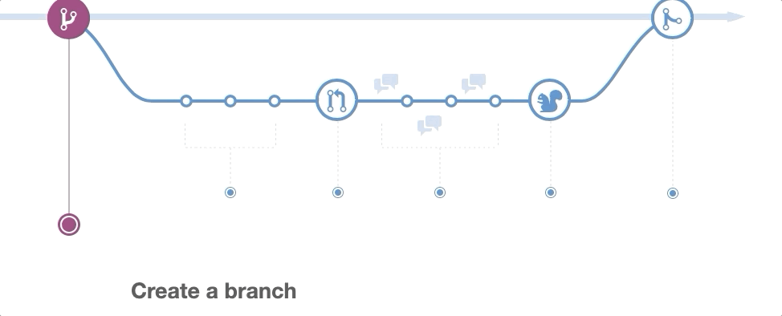

# Branching, merging, and merge conflicts

This lesson introduces branching and merging for team collaboration. Conflict resolution will be covered. This is how you work together on projects!

## Learning objectives

* TNTs will understand the basic of branching, merging, and resolving conflicts.
* TNTs will learn what are merge conflicts, what causes them, how to resolve and reduce them.
* TNTs will be able to create and merge a branch locally and with GitHub.

## Time required and pace

Total time: 2 hour

* 60 minutes - [**Pre-session**](https://github.com/tnt-summer-academy/Curriculum/wiki/%5BENG2.5%5D-Branching-merging-and-merge-conflicts): background learning, research, and investigations
* 60 minutes - **Instructional Session**
    * 25 minutes - explain: recap learning, lesson Demos 
    * 5 minutes - best practices
    * 20 minutes - explore: try it: GiHub Game
    * 10 minutes - elaborate: regroup and review
* [**Post-session**](https://github.com/tnt-summer-academy/Curriculum/wiki/%5BENG2.5%5D-Branching-merging-and-merge-conflicts): review, and investigations

## Pre-session (60 minutes)

Prepare for the session [here](https://github.com/tnt-summer-academy/Curriculum/wiki/%5BENG2.5%5D-Branching-merging-and-merge-conflicts)

## Session set up

* GitHub - For the demos, we wil use the following repository: [NameandFavFood demo](https://github.com/tnt-summer-academy/Samples/tree/main/Week_2/NameandFavFood) in Samples

## Instructional session (60 minutes)

### Recap learning (30 minutes)

Here's how the team development process is applied with GitHub: [Understanding the GitHub Flow](https://guides.github.com/introduction/flow/).

<table style="border: none">
    <tr align="center">
        <td> 
    </td> 
 </tr>
</table>

1. **Demo**: Cloning, branching, committing a repo from GitHub.
    1. We're going to review the basics of creating a branch and merging it in GitHub.
    2. Clone the NameandFavFood repository.
    3. Create a new branch and checkout to the branch.
    4. Open and edit the file in VS Code, adding your name and favorite food.
    5. Commit the changes to the branch.
    6. Push your branch with the changes to GitHub.
    7. Notice Compare and Pull Request in GitHub.
    8. Open a Pull Request to merge to main.
    9. Look at the pull request and complete the pull request and merge.

<table style="border: none">
    <tr align="center">
        <td> </td> 
    </tr>
</table>

2. **Demo**: Show a merge conflict
    1. In your local repo, switch to main branch.
    2. Create a new branch and switch to this new branch.
    3. From VS Code on the branch, make a change to the NameandFavFood by adding a different change.
    4. Commit the changes to the branch.
    5. Push the new branch and changes to GitHub.
    6. Notice the Pull Request and the conflict in GitHub.
    7. Resolve conflict.

<table style="border: none">
    <tr>
        <td></td>
        <td> </td>
    </tr>
</table>
<table style="border: none">
    <tr>
        <td></td>
    </tr>
</table>

3. **Demo**: Show Pull Request in VS Code
    * Install VS Code [Pull Request extension](https://marketplace.visualstudio.com/items?itemName=GitHub.vscode-pull-request-github)
    * Show the navigation and open the created Pull Request from the previous Demo in VS Code

    <table style="border: none">
    <tr>
        <td></td>
        
    </tr>
</table>

### Best practices to resolve and reduce merge conflicts (5 minutes)

1. Git attempts to resolve differences in code. Merge conflicts occur when Git is unable to resolve the differences. This occurs when there are changes made to the same part of the same file on two different branches.
2. Before attempting to merge, make sure any work in progress is either committed or merged. If you need to `git merge --abort`, this will prevent you from losing changes.
3. Take a minute (or several) to understand the conflict. This will help you pick a solution to resolve the conflict.
4. Decide what code should be included in main after the merge. Make the changes to resolve the conflict.
5. Make sure your code is still working as expected and it didn't break any of the old working code
6. Fetch from main and pull into your branch frequently to stay in sync.
7. Plan the work. Breakdown who is working on what and what may conflict.

### Try it: Game Play 

(20 minutes to explain and start playing a few rounds)

1. Together we're going to create a whole bunch of merge conflicts
2. Navigate to the **GitHub Game** repository that you have access to 
3. Play the game using these TWO RULES

    - You will **ONLY** edit the file when on your **feature branch**!
    - You will **NEVER** commit changes when on the **main branch**!

**Setup in VS Code and use VS Code integrated Terminal**

4. Open VS Code
5. Clone the repo into a new directory
6. Create a new branch, call it **sign-in\*-yourName\*** (this will be your ***feature branch***) and check out this new branch using "**git checkout -b \*your feature branch name\***"
7. Modify the *sign-in.txt* code to add your name and the v-account below my name
8. Commit the changes
9. Push your feature branch to Github using "**git push origin \*your feature branch name\***"

**Using GitHub**

7. Make a Pull Request from your branch to main to push changes
8. Resolve the merge conflicts, if there is any. (Check Pull-Merge-Commit-Push details below)
    * Be mindful not to delete other people's response
    * You may have to deal with merge conflicts more than once through this process.

### Pull-Merge-Commit-Push (repeat this part)

*(NOTE: you will need to do this several times since the main branch will be changing using other TNT's Pull Requests )*

 #### From VS Code Integrated Terminal

1. Be sure you are in the directory for this project
2. Type "**git status**" to make sure you are on your **feature** branch and it is clean
3. Type "**git pull origin main**" to pull the current copy of the main branch from the server and merge it into your feature branch
4. Make whatever changes you need to the file so that all of the existing names are included in the list and your name is below all other names
5. Finish the changes and commit them
6. Type "**git status**" to be sure you are on your feature branch and it is clean
7. Type "**git push origin \*your feature branch name\***" to push the updated copy of your feature branch to the server

#### From Github
1. Navigate to your Pull Request
2. Review your Pull Request to see that it shows that it is able to be merged
3. If yes, complete the merge, otherwise see below

#### Repeat over the next few minutes, hours, days...
1. Review your pull request details to see if your branch has conflicts with the current main branch. (Somebody branch has been merged ahead of you or other changes were made to main, sorry!!)
2. Resolve the conflicts using the "Pull-Merge-Commit-Push-Request" steps above (Redo the entire process from pulling the main branch to pushing your feature branch and requesting a new review). Notice that the code continue to incorporate new names into main
3. Repeat until you are able to merge your branch and close your pull request

### Regroup and review (10 minutes)

1. Take a look at the repository commit history, look at all the changes!
2. Are branches or pull requests outstanding?
3. Poll the room - what made this difficult? what helped?

## Post-session

View the post-session [here](https://github.com/tnt-summer-academy/Curriculum/wiki/%5BENG2.5%5D-Branching-merging-and-merge-conflicts)
