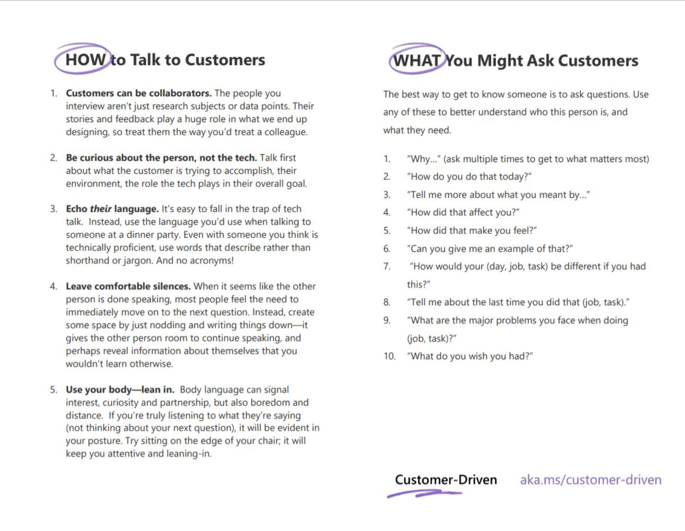

# Usability and interviewing

This session introduces the basics user interviews and usability testing in preparation for the continuous user feedback and testing. After, if it's not wrapped up yet or you'd like to spend additional time on it, revisit the HMW and ideation activities from last week to keep refining and explore solutions.

## Learning objectives

* TNTs will learn how to conduct a usability study.
* TNTs will understand the value of user feedback and how to apply it to product thinking.
* TNTs will practice conducting user interviews

## Time required and pace

Total time: 2 hours

* 30 minutes - pre-session: read Usability and interviewing
* 1 hour 30 minutes - post-session: as a team begin writing your usability script, practice together, discuss and practice with coaches

## Pre-session

Read [Usability and interviewing](https://github.com/tnt-summer-academy/Curriculum/blob/main/Reference/Product%20decks/2.0%20-%20Usability%20and%20interviewing.pdf). This document introduces how to conduct a usability study. The document includes best practices for interviewing and defines the process for conducting a usability study.

## Post-session

As a team draft an interview guide. Later the prototype and task portion will be added. This is a great opportunity to get feedback on your concepts and learn more about the user needs and pain points you're circling in on. Check out the [Sample interview guide](https://github.com/tnt-summer-academy/Curriculum/blob/main/Reference/SampleInteviewGuide.md) for inspiration.

1. Set the goal, background questions, and conclusion
2. Make sure to include not only the questions, but also what you're say in the introduction and conclusion.
3. Create a place where you're going to compile notes from your interview. Best practices for notes:
    - Group notes by participants
    - A table or excel sheet can be used with a question in each column
    - When everyone has conducted their interviews for the week there should be notes from at least 10 participant

### Wrap-up

* Make sure the script is in your team's Teams folders either in OneNote or a doc
* Share with your coaches and get their feedback
* This week, after you create your prototypes and add your tasks, conduct 2-3 usability interviews with people around or use pictures of the paper prototype to conduct remote interviews.

## Additional references

