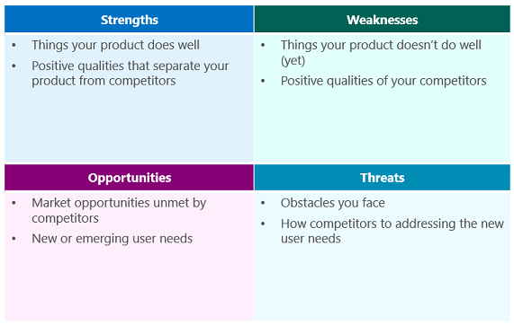

# Competitor audit

This session introduces inventory and analysis of products that meet similar user needs. NTs use the SWOT (Strength, Weaknesses, Opportunities, and Threats) framework to asses other solutions and refine their value prop.

## Learning objectives

* TNTs will learn how to objectively evaluate competitive products.
* TNTs will be understand the SWOT framework.
* TNTs will conduct a SWOT analysis.

## Time required and pace

Total time: 2 hours

* 45 minutes - pre-session: favorite communication app, read introduction to competitor audit
* 1 hour 15 minutes - post-session: competitive research and create SWOT diagram

## Pre-session

### Favorite communication app (10 min)

* Think about the different applications you use to communicate with other people.
* Which one is your favorite? Which one couldn't you do with out? What user need does it meet? What does it do better than the rest of the apps?
* Later, share with your team.

### Introduction to competitor analysis (20 minutes)

Looking at other products, how existing solutions on the market meet the same needs or similar needs with your customer base has a few benefits:

* Inspiration - other products can push your thinking. Rather than copying features, think about what the product does well and identify what is so great about how it addresses the user need. Try the "how might we framing" around the need you identifying to push your product thinking further.
* Comparison - takings a step back and looking at the broader market in which your solution will be entering can help you identify your products strength, weaknesses, opportunities and threats.
  * Strength: What does your app do well today?
  * Weaknesses: Where does your app need to improve?
  * Opportunities: What are your goals? What advantages does your app have over others?
  * Threats: What obstacles do you face? What are competitors doing to meet the emerging user needs?
* Pitch -  a competitor analysis can help refine your app value prop and pitch. It allows you to both acknowledge how others are addressing customer needs and speak to why yours is better, amazing, and incredible.

This can be part of both the Empathize and Ideate design phases. It expands your understanding of what users do today and can inspire wider ideation.

Here's an outline on how to get started and conduct a competitor audit:

1. Before diving in and looking at competitors think about what you want to learn. Some questions to consider:
    * Who uses the solution today? Does it align with my target customer or another market? Quantitatively, how many people use the app? How many downloads does it have or do they publish usage numbers?
    * What needs does the solution meet? Are they the similar or the same? What does the app dow?
    * Where is the solution accessible from? Is there an app? A website? App + website?
    * When is the solution introduce in the user journey? When would a customer use the app?
    * How does the solution meet the user needs? What features does it have?

2. After identifying the goals of what you want to learn, make a list of the competitors to investigate. Competitors may both be other apps, direct competitors, adjacent apps, apps that meet similar needs, or a solution that's not an app at all. Think about communication, let's say your building a video sharing tool for small snippets, quick videos.
    * Competitors: SnapChat and TikTok. Looking at solutions that didn't last like Vine may also provide insight.
    * Adjacent competitors: consider solutions that also allow video sharing, Instagram or Facebook. Another direction to go could be communication tools, an email app or Discord.
    * Non-apps competitors: Gifs have wide saturation and are a short form of video  You could look into a Gif platform like Giphy. It's helpful to stretch out of the app mindset. What did people do before apps? What does video sharing look like with CDs or VHSs?

3. Conduct the research. Learn about the competitors. Some places to look:
    * Product landing page - the website that describes the app may have the app's mission and vision. There might be a clearly articulated value prop.
    * Store - in the app store you can find info on what the app does, but also user reviews. Do the users ask for missing features? Is the app unreliably? Do users love it, why?
    * User forums - outside of the app store, does the product have another help page or place for feedback? What are users saying there? Is there a following of the product? What are people saying on social media or discussion groups?
    * Social media - how does the product represent itself? What are people saying about the product?

4. Synthesize and pull all of your research together.
    * What trends have you noticed across competitors?
    * What have you learned that customers love?
    * Where do users seem room for improvement? Where are the gaps in meeting user needs?
    * List the strengths, weaknesses, opportunities, and threats.

5. Create a SWOT (Strength, Weaknesses, Opportunities, Threat) diagram.
    * A SWOT diagram is a tool for concisely compiling your competitor audit.
    * *Hint*: a table is an easy way to layout the information.

        

## Post-session

Get started with customer research and creating a SWOT diagram.

1. As a team, discuss what you want to learn.
2. As a team, make a list of the competitors. Make sure to include direct competitors, adjacent competitors, and non-app competitors.
3. Divide the competitors up. You may have overlap. Everyone should have 2-3 competitors to research.
4. Independently, conduct customer research. Take notes as you go.
5. Independently, compile your findings. Make lists of strengths, weaknesses, opportunities, and threats.
6. As a team, compile your findings. Create a combine SWOT diagram.
7. Discuss how this research improves your value prop and pitch. Revise and iterate on you value prop and pitch.

### Wrap-up

* Make sure your SWOT diagram is saved in your team's Team folder.
* Share with your coaches how the competitor investigation improved your pitch.
