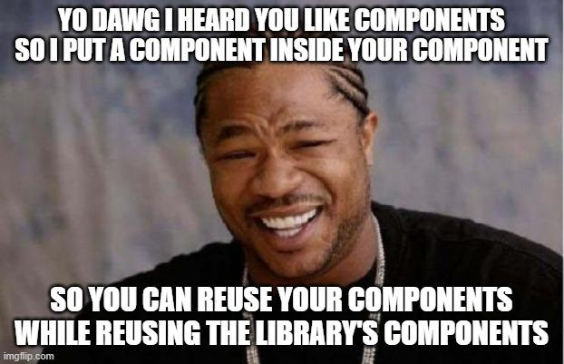

# Component Libraries

This lesson provides an overview of component libraries (specifically Fluent UI), including both how to use FluentUI and tips on reading documentation

## Learning objectives

* TNTs will understand what component libraries are
* TNTs will write code that demonstrates how to import component libraries into their project, and how to utilize existing components/controls/widgets in their existing project
* TNTs will write code that demonstrates how to create and use new, custom components in their existing project

## Time required and pace

* 60 minutes - pre-session: background learning, research, and investigations
	* 15 minutes - Installing/Using Fluent UI
	* 15 minutes - Examine demo code
	* 30 minutes - Reflect on demo code, read the docs
* 60 minutes - Session:
	* 10 minutes – answer review questions in your table group
	* 5 minutes – what are component libraries
	* 15 minutes – using components inside your components
	* 15 minutes - how to read documentation
	* 15 minutes - Reacting to user input on the components
* 60 minutes - post-session: what to continue working on, how it ties into the next sessions or projects
	* 10 minutes - Styling the FluentUI components with the Theme Designer
	* 10 minutes - Styling Your Page with CSS 
	* 30 minutes - practice building a new React component using Fluent UI components
	* 10 minutes - Reflect, incorporate, plan

## Session (The lesson)

### Exercise: Pre-session Review Questions

Working within a group, do your best to answer the following questions:

1. Before you even try to get the app working, what do you need to do?  How do you do that?

1. If you wanted to change the image and text in the Persona control, how would you do that?

1. Why do you need the import statement at the top?
	- Stretch Question: Why can't you leave out the { } like you can when importing react?

1. Do you think you need the `<div id="persona-container">` in the above example?  If it can be left out of this example: can you always leave it out (i.e., it's never needed), or is the div only optional in this example?

1. What sort of UI components / widgets did you find (if any)?  What looks useful for your app?

1. Why do you think a collection of widgets (like this FluentUI library) would be useful in general?

### Demo: What are component libraries

A component library is a collection of components installed generally through a package manager that provides common solutions whether it's a UI library, testing library, etc.

Why use a component library?

* Prebuilt out of the box solutions
* Increase speed of delivery
* Customization of an application
* Allows focus on core application competencies vs boilerplate features

Things to consider before using a component library

* Components may become outdated as other technologies advance
* Consider the popularity and community activity for the component library
* Ease of use generally through an API defined by the component library
* Tradeoffs between speed, customization time, cost and immediate business needs

### Demo: Using components inside your components



In this example, we'll look at putting the Persona component inside new custom component that you create, all inside of a single `.TSX` file

Here's the finished code for a single-file example of using Fluent UI's `Persona` component in a new component of our own.  We'll go through highlights of this after you see the code:

```typescript
	import React from 'react';
	import { Component } from 'react';
	
	import { Persona, IPersonaProps } from "@fluentui/react"

	export class MyPersona extends Component<IPersonaProps> {
		render() {
		return (
			<div id="persona-container">
			<Persona
				imageUrl={this.props.imageUrl}
				text={this.props.text}
				secondaryText={this.props.secondaryText}
			/>
			</div>
		);
		}
	}

	class App extends React.Component {

		public render() {
		return (
			<div className="App">
			<h1>Hello Component Library!</h1>
			<h2>This example has everything in a single .TSX file</h2>
			<div style={{ backgroundColor: "yellow" }}> {/* Div is here only to highlight where the component starts/ends*/}
			
			<MyPersona
				text="Text"
				secondaryText="Secondary Text"
				imageUrl="https://th.bing.com/th/id/OIP.x8Jwnqge_gR1-412yihxJQHaHa?w=177&h=173&c=7&o=5&dpr=1.25&pid=1.7"
				/>

			</div>
			</div >
		);
		}
	}
	export default App;
```
Some things to pay particular attention to:

1. Notice that we had to import a couple of interfaces:

	`import { Persona, IPersonaProps } from "@fluentui/react"`

	This is necessary so that we can accept the standard Persona attributes (text, secondaryText, imageUrl) in our MyPersona in the JSX/HTML.

1. Because we want our new component (`MyPersona`) to extend FluentUI's `Persona` we need to tell Typescript that via this line:

	`class MyPersona extends Component<IPersonaProps> `

	We tell Typescript that our new component accepts the same attributes as a normal Persona component by passing the IPersonaProps here.

	* This is what allows us to write `this.props.text`, etc

1. Other than that the MyPersona component should closely resemble other components you've seen.

1. Inside the `App` class you can now use the MyPersona component.

Note: normally your component would have several different widgets/controls but we want our examples to start simple and build up.

#### Exercise

Take the above code (with the component AND the App class) and separate the component out into a separate file.

There's an [EXAMPLE SOLUTION](ENG3.3/SeparatingComponentIntoFiles.md) here.  The idea is that you can use this to check your work during the class session, as a reference afterwards, and also to help get you unstuck if you and your group are stuck.

### Demo: How to read documentation

[https://developer.microsoft.com/en-us/fluentui#/get-started](https://developer.microsoft.com/en-us/fluentui#/get-started)

Most (if not all) libraries will contain a "How to" section to quicky get started but may not include how to use all the components. This is where knowing how to interpret documentation and more importantly class interfaces.

A few tips on reading documentation:

* Look for examples or demos
* Class interfaces

Below is a link to Persona properties interface.

[https://developer.microsoft.com/en-us/fluentui#/controls/web/persona](https://developer.microsoft.com/en-us/fluentui#/controls/web/persona)

* Explain interfaces
* Explain the use of 'extends' and how to navigate interface extensions

Documentation is also good for when you're not sure if something will *always* work - like "do you need the persona-container?"

Answer ([AFAICT](https://www.urbandictionary.com/define.php?term=afaict): No.  B/c it's not mentioned on the documentation page anywhere)

### Demo: Reacting to user input on the components
Demo: In this code sample we'll change the 'text' that the persona displays into a 'click counter', so that our component will do something every time you click on it.

```typescript
import React from 'react';
import { Component } from 'react';
import { Persona, IPersonaProps } from "@fluentui/react"

interface IState {
  click_count: number
}

export default class MyPersona extends Component<IPersonaProps, IState> {

  constructor(props: any) {
    super(props);
    this.state = {
      click_count: 0
    }
  }

  private moveToNextText = () => {
    console.log("Hi " + this.state.click_count);
   this.setState(
        state => ({ click_count: state.click_count + 1 }));
  }

  render() {
    return (
      <div id="persona-container">
        <Persona
          imageUrl={this.props.imageUrl}
          text={this.props.text + " You clicked this " + this.state.click_count.toString() + " times!"}
          secondaryText={this.props.secondaryText}
          onClick={this.moveToNextText}
        />
      </div>
    );
  }
}

```
Important details:

1. Because we want our component to have a variable in it's state we'll need to add this:

	```typescript
	interface IState {
		click_count: number
	}	
	```

1. Notice that we pass in the `IState` when declaring the class: `class MyPersona extends Component<IPersonaProps, IState>`

	* You must list out the props (`IPersonaProps`) THEN the state (`IState`)

1. We'll set up the initial state in the constructor:

	```typescript
	constructor(props: any) {
		super(props);
		this.state = {
			click_count: 0
		}
	}
	```
	* You **MUST** call `super(props);` and you must do this first

1. The actual method (function) that gets called is this one.  Note that it must go "inside" the class:

	```typescript
	private moveToNextText = () => {
		console.log("Hi " + this.state.click_count);
		this.setState(
        state => ({ click_count: state.click_count + 1 }));
	}
	```
 1. Having defined the method that we _want_ to run is great, but doesn't tell TypeScript to connect that method to any particular action in our component.  This line will tell Typescript that when the component is clicked it should run that method:

	```typescript
	onClick={this.moveToNextText}	
	```